``` r
#Determination of Contact Angle from Multiple Regression of Diameter vs Time and Multiple Regression of Contact Angle vs Time#
#set working directory to work on EXCEL files#
setwd(dir="C:/Users/dell user/Desktop/Work/Contact_Angle/Contact Angle Resources/Data/CM")

#Pull the data from the desktop#
cadata <- readxl::read_excel("CM-S1-1A_FINAL.xlsx")
cadata <- data.frame(cadata)

#Select on the variables of CA, Time, and Diameter#
CAM <- data.frame(CA=c(cadata$Var.6), Time=c(cadata$Var.13), Diam=c(cadata$Var.11))

#Select only the values in the column which are numeric#
CAM <- CAM[!is.na(as.numeric(as.character(CAM$CA))), ]
```

    ## Warning in `[.data.frame`(CAM, !is.na(as.numeric(as.character(CAM$CA))), :
    ## NAs introduced by coercion

``` r
#Transform the data back into numbers, extract CAo (Co)#
CA<-c(as.numeric(levels(CAM$CA))[CAM$CA])
```

    ## Warning: NAs introduced by coercion

``` r
Time<-c(as.numeric(levels(CAM$Time))[CAM$Time])
```

    ## Warning: NAs introduced by coercion

``` r
Diam<-c(as.numeric(levels(CAM$Diam))[CAM$Diam])
```

    ## Warning: NAs introduced by coercion

``` r
Co<-CA[c(1)]
Do<-Diam[c(1)]

Diam <- c(Diam/Do)
CAT <- c(Co/CA)
CAO <- c(CA/Co)

CAM <- data.frame(CA=c(CA), Time=c(Time), Diam=c(Diam), CAO=c(CAO), CAT=c(CAT))

#Plot raw data Diameter vs Time#
library(ggplot2)
Diamplot <- ggplot(CAM, aes(Time, Diam))+
  geom_point()

print(Diamplot)
```

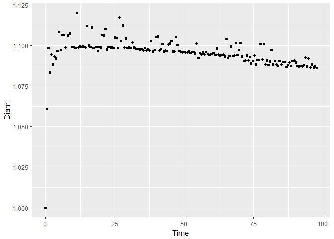

``` r
#regression for Diam vs Time#
m <- nls(Diam ~ 1+b*(1-exp(-Time/a)),start=list(a=1,b=1), data=CAM)
m
```

    ## Nonlinear regression model
    ##   model: Diam ~ 1 + b * (1 - exp(-Time/a))
    ##    data: CAM
    ##       a       b 
    ## 0.47455 0.09646 
    ##  residual sum-of-squares: 0.006533
    ## 
    ## Number of iterations to convergence: 4 
    ## Achieved convergence tolerance: 5.872e-06

``` r
#plot for Diam vs time#
Diamplot1<-ggplot(data=CAM, aes(x=Time,y=Diam))+
  geom_point()+
  geom_smooth(method="nls", 
              formula=y~1+b*(1-exp(-x/a)),
              method.args=list(start=c(a=1, b=1)),
              se=FALSE,
              data=CAM,
              color="red")

print(Diamplot1)
```

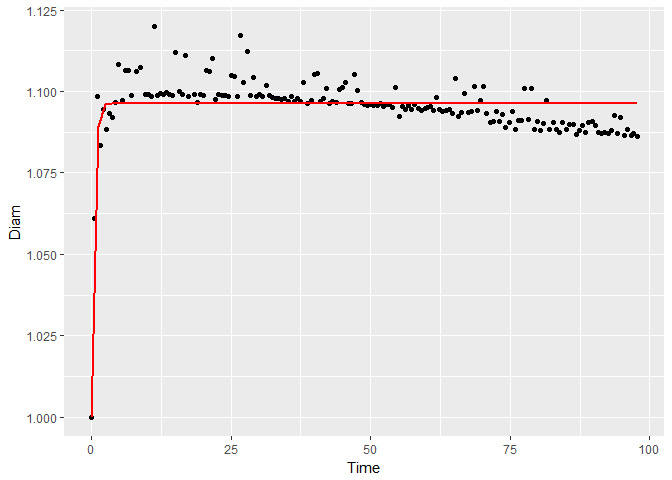

``` r
#Coefficient of Correlation for Diam vs Time model#
Rsquared_Diam <- cor(CAM$Diam, predict(m))

#generate table for regression parameters#
library(broom)
reg <- tidy(m)

#transform a parameter into range of regression#
a <- reg$estimate
a <- a[c(1)]
range <- 3*a

#make a variable for the b parameter for diameter vs time#
b <- reg$estimate
b <- b[c(2)]

#regression for CAO=(CA/Cao) vs Time#
m3 <- nls(CAO~1+e*(Time^f),start=list(e=1,f=1), data=CAM)
m3
```

    ## Nonlinear regression model
    ##   model: CAO ~ 1 + e * (Time^f)
    ##    data: CAM
    ##       e       f 
    ## -0.1369  0.1443 
    ##  residual sum-of-squares: 0.01506
    ## 
    ## Number of iterations to convergence: 9 
    ## Achieved convergence tolerance: 3.652e-06

``` r
#plot for m3#
CAOplot <- ggplot(data=CAM, aes(x=Time, y=CAO))+
  geom_point()+
  geom_smooth(method="nls",
              formula=y~1+(e*x^f),
              method.args=list(start=c(e=1, f=1)),
              se=FALSE)

print(CAOplot)
```


``` r
#Coefficient of correlation for CA/CAo vs Time (model=m3)#
Rsquared_CAO <- cor(CAM$CAO, predict(m3))

#generate table for regression parameters#
reg3<- tidy(m3)

e <- reg3$estimate
e <- e[c(1)]

f <- reg3$estimate
f <- f[c(2)]

#regression for CA using next method#
m4 <- nls(CAT~h*(Time^g)+1,start=list(h=1,g=1), data=CAM)
m4
```

    ## Nonlinear regression model
    ##   model: CAT ~ h * (Time^g) + 1
    ##    data: CAM
    ##      h      g 
    ## 0.1511 0.1902 
    ##  residual sum-of-squares: 0.04418
    ## 
    ## Number of iterations to convergence: 9 
    ## Achieved convergence tolerance: 3.241e-06

``` r
CATplot <- ggplot(data=CAM, aes(x=Time, y=CAT))+
  geom_point()+
  geom_smooth(method="nls",
              formula=y~1+(h*(x^g)),
              method.args=list(start=c(h=1, g=1)),
              se=FALSE)
print(CATplot)
```

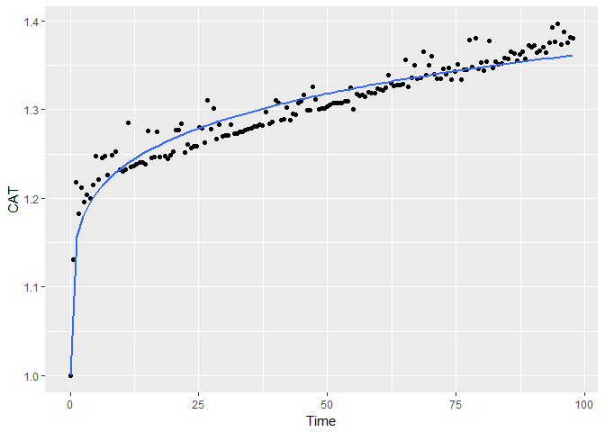

``` r
Rsquared_CAT <- cor(CAM$CAT, predict(m4))

#generate table or regression parameters#
reg4 <- tidy(m4)

h <- reg4$estimate
h <- h[c(1)]

g <- reg4$estimate
g <- g[c(2)]

#Fit CAeq using the range from Diam vs Time regression and the model m4#
CATeq <- (Co)/(1+(h*(range^g)))

#Fit CAeq using the range from Diam vs Time regression and the model m3#
CAOeq <- (1+e*range^f)*(Co)

#Store the information for this rep in a data frame#
CM_S1_1A <- data.frame(range, b, e, f, g, h, Rsquared_Diam, Rsquared_CAO, Rsquared_CAT, CAOeq, CATeq)

#Pull the data from the desktop#
cadata <- readxl::read_excel("CM-S1-1B_FINAL.xlsx")
cadata <- data.frame(cadata)

#Select on the variables of CA, Time, and Diameter#
CAM <- data.frame(CA=c(cadata$Var.6), Time=c(cadata$Var.13), Diam=c(cadata$Var.11))

#Select only the values in the column which are numeric#
CAM <- CAM[!is.na(as.numeric(as.character(CAM$CA))), ]
```

    ## Warning in `[.data.frame`(CAM, !is.na(as.numeric(as.character(CAM$CA))), :
    ## NAs introduced by coercion

``` r
#Transform the data back into numbers, extract CAo (Co)#
CA<-c(as.numeric(levels(CAM$CA))[CAM$CA])
```

    ## Warning: NAs introduced by coercion

``` r
Time<-c(as.numeric(levels(CAM$Time))[CAM$Time])
```

    ## Warning: NAs introduced by coercion

``` r
Diam<-c(as.numeric(levels(CAM$Diam))[CAM$Diam])
```

    ## Warning: NAs introduced by coercion

``` r
Co<-CA[c(1)]
Do<-Diam[c(1)]

Diam <- c(Diam/Do)
CAT <- c(Co/CA)
CAO <- c(CA/Co)

CAM <- data.frame(CA=c(CA), Time=c(Time), Diam=c(Diam), CAO=c(CAO), CAT=c(CAT))

#Plot raw data Diameter vs Time#
library(ggplot2)
Diamplot <- ggplot(CAM, aes(Time, Diam))+
  geom_point()

print(Diamplot)
```

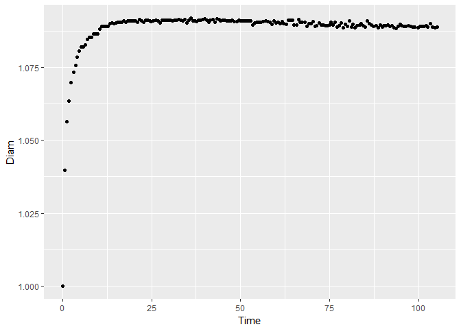

``` r
#regression for Diam vs Time#
m <- nls(Diam ~ 1+b*(1-exp(-Time/a)),start=list(a=1,b=1), data=CAM)
m
```

    ## Nonlinear regression model
    ##   model: Diam ~ 1 + b * (1 - exp(-Time/a))
    ##    data: CAM
    ##       a       b 
    ## 1.51702 0.08993 
    ##  residual sum-of-squares: 0.0006766
    ## 
    ## Number of iterations to convergence: 11 
    ## Achieved convergence tolerance: 3.491e-06

``` r
#plot for Diam vs time#
Diamplot1<-ggplot(data=CAM, aes(x=Time,y=Diam))+
  geom_point()+
  geom_smooth(method="nls", 
              formula=y~1+b*(1-exp(-x/a)),
              method.args=list(start=c(a=1, b=1)),
              se=FALSE,
              data=CAM,
              color="red")

print(Diamplot1)
```

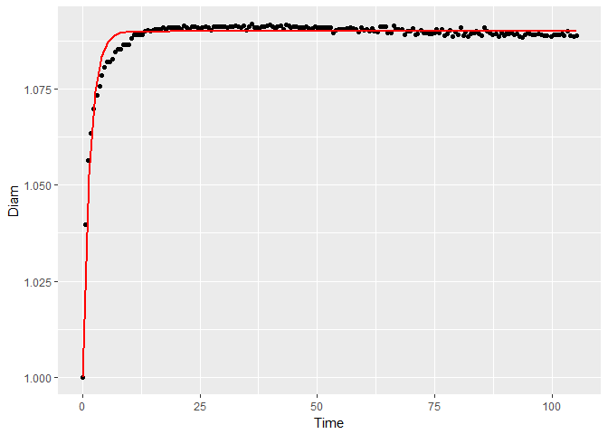

``` r
#Coefficient of Correlation for Diam vs Time model#
Rsquared_Diam <- cor(CAM$Diam, predict(m))

#generate table for regression parameters#
library(broom)
reg <- tidy(m)

#transform a parameter into range of regression#
a <- reg$estimate
a <- a[c(1)]
range <- 3*a

#make a variable for the b parameter for diameter vs time#
b <- reg$estimate
b <- b[c(2)]

#regression for CAO=(CA/Cao) vs Time#
m3 <- nls(CAO~1+e*(Time^f),start=list(e=1,f=1), data=CAM)
m3
```

    ## Nonlinear regression model
    ##   model: CAO ~ 1 + e * (Time^f)
    ##    data: CAM
    ##        e        f 
    ## -0.04516  0.26520 
    ##  residual sum-of-squares: 0.002676
    ## 
    ## Number of iterations to convergence: 9 
    ## Achieved convergence tolerance: 5.754e-07

``` r
#plot for m3#
CAOplot <- ggplot(data=CAM, aes(x=Time, y=CAO))+
  geom_point()+
  geom_smooth(method="nls",
              formula=y~1+(e*x^f),
              method.args=list(start=c(e=1, f=1)),
              se=FALSE)

print(CAOplot)
```

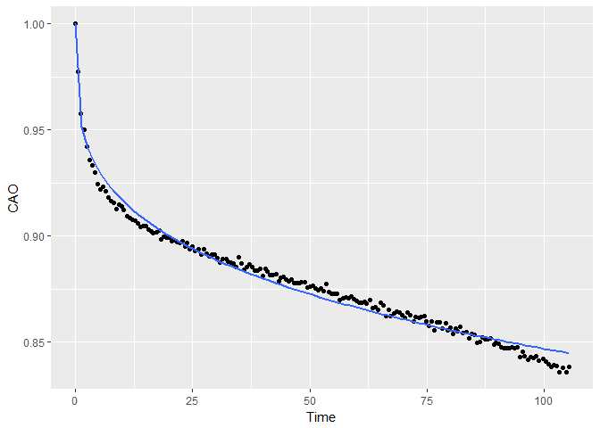

``` r
#Coefficient of correlation for CA/CAo vs Time (model=m3)#
Rsquared_CAO <- cor(CAM$CAO, predict(m3))

#generate table for regression parameters#
reg3<- tidy(m3)

e <- reg3$estimate
e <- e[c(1)]

f <- reg3$estimate
f <- f[c(2)]

#regression for CA using next method#
m4 <- nls(CAT~h*(Time^g)+1,start=list(h=1,g=1), data=CAM)
m4
```

    ## Nonlinear regression model
    ##   model: CAT ~ h * (Time^g) + 1
    ##    data: CAM
    ##       h       g 
    ## 0.04486 0.30244 
    ##  residual sum-of-squares: 0.004948
    ## 
    ## Number of iterations to convergence: 8 
    ## Achieved convergence tolerance: 8.031e-06

``` r
CATplot <- ggplot(data=CAM, aes(x=Time, y=CAT))+
  geom_point()+
  geom_smooth(method="nls",
              formula=y~1+(h*(x^g)),
              method.args=list(start=c(h=1, g=1)),
              se=FALSE)
print(CATplot)
```

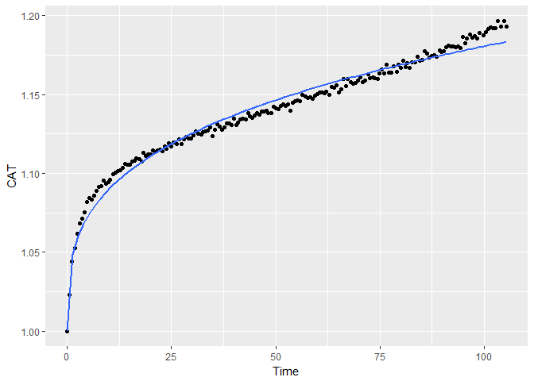

``` r
Rsquared_CAT <- cor(CAM$CAT, predict(m4))

#generate table or regression parameters#
reg4 <- tidy(m4)

h <- reg4$estimate
h <- h[c(1)]

g <- reg4$estimate
g <- g[c(2)]

#Fit CAeq using the range from Diam vs Time regression and the model m4#
CATeq <- (Co)/(1+(h*(range^g)))

#Fit CAeq using the range from Diam vs Time regression and the model m3#
CAOeq <- (1+e*range^f)*(Co)

#Store the information for this rep in a data frame#
CM_S1_1B <- data.frame(range, b, e, f, g, h, Rsquared_Diam, Rsquared_CAO, Rsquared_CAT, CAOeq, CATeq)

#Pull the data from the desktop#
cadata <- readxl::read_excel("CM-S1-1C_FINAL.xlsx")
cadata <- data.frame(cadata)

#Select on the variables of CA, Time, and Diameter#
CAM <- data.frame(CA=c(cadata$Var.6), Time=c(cadata$Var.13), Diam=c(cadata$Var.11))

#Select only the values in the column which are numeric#
CAM <- CAM[!is.na(as.numeric(as.character(CAM$CA))), ]
```

    ## Warning in `[.data.frame`(CAM, !is.na(as.numeric(as.character(CAM$CA))), :
    ## NAs introduced by coercion

``` r
#Transform the data back into numbers, extract CAo (Co)#
CA<-c(as.numeric(levels(CAM$CA))[CAM$CA])
```

    ## Warning: NAs introduced by coercion

``` r
Time<-c(as.numeric(levels(CAM$Time))[CAM$Time])
```

    ## Warning: NAs introduced by coercion

``` r
Diam<-c(as.numeric(levels(CAM$Diam))[CAM$Diam])
```

    ## Warning: NAs introduced by coercion

``` r
Co<-CA[c(1)]
Do<-Diam[c(1)]

Diam <- c(Diam/Do)
CAT <- c(Co/CA)
CAO <- c(CA/Co)

CAM <- data.frame(CA=c(CA), Time=c(Time), Diam=c(Diam), CAO=c(CAO), CAT=c(CAT))

#Plot raw data Diameter vs Time#
library(ggplot2)
Diamplot <- ggplot(CAM, aes(Time, Diam))+
  geom_point()

print(Diamplot)
```


``` r
#regression for Diam vs Time#
m <- nls(Diam ~ 1+b*(1-exp(-Time/a)),start=list(a=1,b=1), data=CAM)
m
```

    ## Nonlinear regression model
    ##   model: Diam ~ 1 + b * (1 - exp(-Time/a))
    ##    data: CAM
    ##       a       b 
    ## 0.86847 0.04689 
    ##  residual sum-of-squares: 0.0004626
    ## 
    ## Number of iterations to convergence: 13 
    ## Achieved convergence tolerance: 7.461e-06

``` r
#plot for Diam vs time#
Diamplot1<-ggplot(data=CAM, aes(x=Time,y=Diam))+
  geom_point()+
  geom_smooth(method="nls", 
              formula=y~1+b*(1-exp(-x/a)),
              method.args=list(start=c(a=1, b=1)),
              se=FALSE,
              data=CAM,
              color="red")

print(Diamplot1)
```

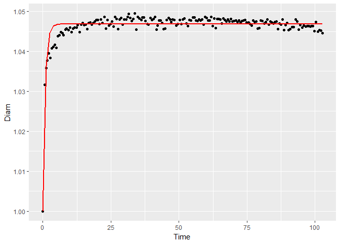

``` r
#Coefficient of Correlation for Diam vs Time model#
Rsquared_Diam <- cor(CAM$Diam, predict(m))

#generate table for regression parameters#
library(broom)
reg <- tidy(m)

#transform a parameter into range of regression#
a <- reg$estimate
a <- a[c(1)]
range <- 3*a

#make a variable for the b parameter for diameter vs time#
b <- reg$estimate
b <- b[c(2)]

#regression for CAO=(CA/Cao) vs Time#
m3 <- nls(CAO~1+e*(Time^f),start=list(e=1,f=1), data=CAM)
m3
```

    ## Nonlinear regression model
    ##   model: CAO ~ 1 + e * (Time^f)
    ##    data: CAM
    ##        e        f 
    ## -0.04918  0.23952 
    ##  residual sum-of-squares: 0.003243
    ## 
    ## Number of iterations to convergence: 9 
    ## Achieved convergence tolerance: 2.415e-06

``` r
#plot for m3#
CAOplot <- ggplot(data=CAM, aes(x=Time, y=CAO))+
  geom_point()+
  geom_smooth(method="nls",
              formula=y~1+(e*x^f),
              method.args=list(start=c(e=1, f=1)),
              se=FALSE)

print(CAOplot)
```

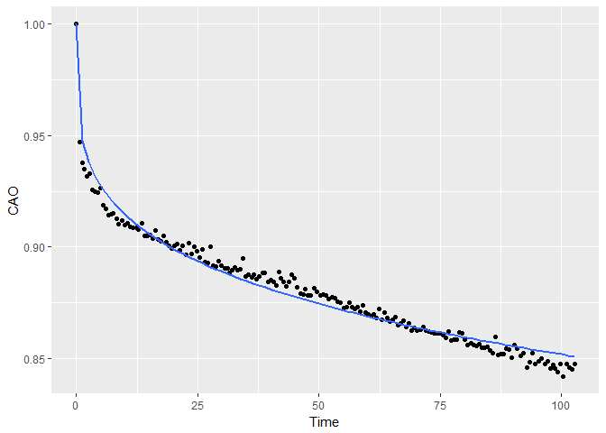

``` r
#Coefficient of correlation for CA/CAo vs Time (model=m3)#
Rsquared_CAO <- cor(CAM$CAO, predict(m3))

#generate table for regression parameters#
reg3<- tidy(m3)

e <- reg3$estimate
e <- e[c(1)]

f <- reg3$estimate
f <- f[c(2)]

#regression for CA using next method#
m4 <- nls(CAT~h*(Time^g)+1,start=list(h=1,g=1), data=CAM)
m4
```

    ## Nonlinear regression model
    ##   model: CAT ~ h * (Time^g) + 1
    ##    data: CAM
    ##       h       g 
    ## 0.04912 0.27470 
    ##  residual sum-of-squares: 0.005912
    ## 
    ## Number of iterations to convergence: 9 
    ## Achieved convergence tolerance: 3.954e-06

``` r
CATplot <- ggplot(data=CAM, aes(x=Time, y=CAT))+
  geom_point()+
  geom_smooth(method="nls",
              formula=y~1+(h*(x^g)),
              method.args=list(start=c(h=1, g=1)),
              se=FALSE)
print(CATplot)
```

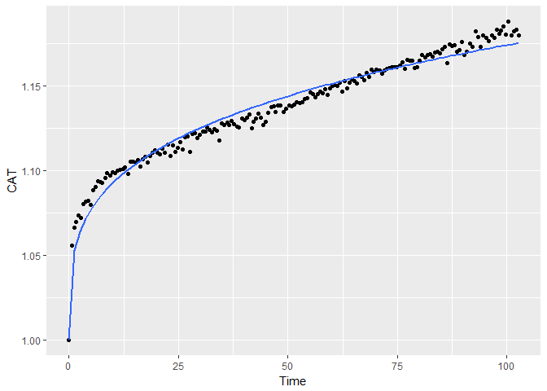

``` r
Rsquared_CAT <- cor(CAM$CAT, predict(m4))

#generate table or regression parameters#
reg4 <- tidy(m4)

h <- reg4$estimate
h <- h[c(1)]

g <- reg4$estimate
g <- g[c(2)]

#Fit CAeq using the range from Diam vs Time regression and the model m4#
CATeq <- (Co)/(1+(h*(range^g)))

#Fit CAeq using the range from Diam vs Time regression and the model m3#
CAOeq <- (1+e*range^f)*(Co)

#Store the information for this rep in a data frame#
CM_S1_1C <- data.frame(range, b, e, f, g, h, Rsquared_Diam, Rsquared_CAO, Rsquared_CAT, CAOeq, CATeq)

#Pull the data from the desktop#
cadata <- readxl::read_excel("CM-S1-2A_FINAL.xlsx")
cadata <- data.frame(cadata)

#Select on the variables of CA, Time, and Diameter#
CAM <- data.frame(CA=c(cadata$Var.6), Time=c(cadata$Var.13), Diam=c(cadata$Var.11))

#Select only the values in the column which are numeric#
CAM <- CAM[!is.na(as.numeric(as.character(CAM$CA))), ]
```

    ## Warning in `[.data.frame`(CAM, !is.na(as.numeric(as.character(CAM$CA))), :
    ## NAs introduced by coercion

``` r
#Transform the data back into numbers, extract CAo (Co)#
CA<-c(as.numeric(levels(CAM$CA))[CAM$CA])
```

    ## Warning: NAs introduced by coercion

``` r
Time<-c(as.numeric(levels(CAM$Time))[CAM$Time])
```

    ## Warning: NAs introduced by coercion

``` r
Diam<-c(as.numeric(levels(CAM$Diam))[CAM$Diam])
```

    ## Warning: NAs introduced by coercion

``` r
Co<-CA[c(1)]
Do<-Diam[c(1)]

Diam <- c(Diam/Do)
CAT <- c(Co/CA)
CAO <- c(CA/Co)

CAM <- data.frame(CA=c(CA), Time=c(Time), Diam=c(Diam), CAO=c(CAO), CAT=c(CAT))

#Plot raw data Diameter vs Time#
library(ggplot2)
Diamplot <- ggplot(CAM, aes(Time, Diam))+
  geom_point()

print(Diamplot)
```

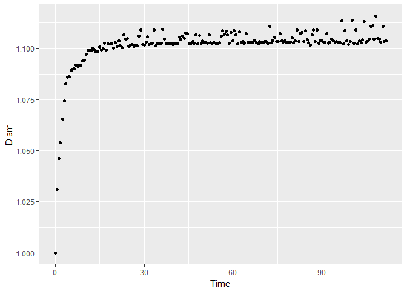

``` r
#regression for Diam vs Time#
m <- nls(Diam ~ 1+b*(1-exp(-Time/a)),start=list(a=1,b=1), data=CAM)
m
```

    ## Nonlinear regression model
    ##   model: Diam ~ 1 + b * (1 - exp(-Time/a))
    ##    data: CAM
    ##      a      b 
    ## 2.5242 0.1038 
    ##  residual sum-of-squares: 0.00215
    ## 
    ## Number of iterations to convergence: 10 
    ## Achieved convergence tolerance: 3.032e-06

``` r
#plot for Diam vs time#
Diamplot1<-ggplot(data=CAM, aes(x=Time,y=Diam))+
  geom_point()+
  geom_smooth(method="nls", 
              formula=y~1+b*(1-exp(-x/a)),
              method.args=list(start=c(a=1, b=1)),
              se=FALSE,
              data=CAM,
              color="red")

print(Diamplot1)
```

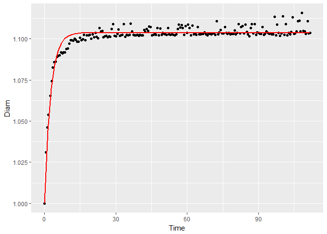

``` r
#Coefficient of Correlation for Diam vs Time model#
Rsquared_Diam <- cor(CAM$Diam, predict(m))

#generate table for regression parameters#
library(broom)
reg <- tidy(m)

#transform a parameter into range of regression#
a <- reg$estimate
a <- a[c(1)]
range <- 3*a

#make a variable for the b parameter for diameter vs time#
b <- reg$estimate
b <- b[c(2)]

#regression for CAO=(CA/Cao) vs Time#
m3 <- nls(CAO~1+e*(Time^f),start=list(e=1,f=1), data=CAM)
m3
```

    ## Nonlinear regression model
    ##   model: CAO ~ 1 + e * (Time^f)
    ##    data: CAM
    ##        e        f 
    ## -0.07105  0.22221 
    ##  residual sum-of-squares: 0.01127
    ## 
    ## Number of iterations to convergence: 9 
    ## Achieved convergence tolerance: 9.501e-07

``` r
#plot for m3#
CAOplot <- ggplot(data=CAM, aes(x=Time, y=CAO))+
  geom_point()+
  geom_smooth(method="nls",
              formula=y~1+(e*x^f),
              method.args=list(start=c(e=1, f=1)),
              se=FALSE)

print(CAOplot)
```

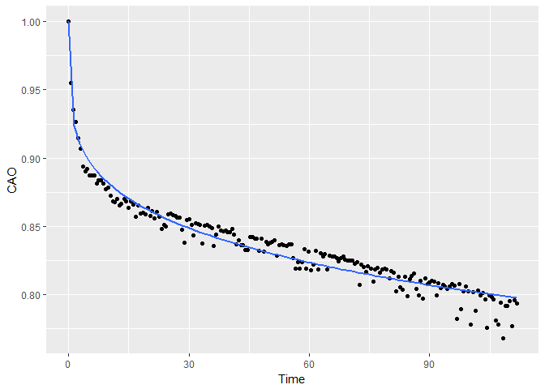

``` r
#Coefficient of correlation for CA/CAo vs Time (model=m3)#
Rsquared_CAO <- cor(CAM$CAO, predict(m3))

#generate table for regression parameters#
reg3<- tidy(m3)

e <- reg3$estimate
e <- e[c(1)]

f <- reg3$estimate
f <- f[c(2)]

#regression for CA using next method#
m4 <- nls(CAT~h*(Time^g)+1,start=list(h=1,g=1), data=CAM)
m4
```

    ## Nonlinear regression model
    ##   model: CAT ~ h * (Time^g) + 1
    ##    data: CAM
    ##       h       g 
    ## 0.07209 0.26684 
    ##  residual sum-of-squares: 0.02616
    ## 
    ## Number of iterations to convergence: 8 
    ## Achieved convergence tolerance: 1.163e-06

``` r
CATplot <- ggplot(data=CAM, aes(x=Time, y=CAT))+
  geom_point()+
  geom_smooth(method="nls",
              formula=y~1+(h*(x^g)),
              method.args=list(start=c(h=1, g=1)),
              se=FALSE)
print(CATplot)
```

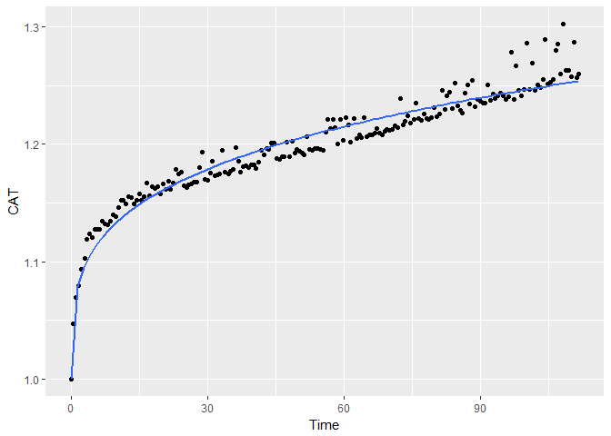

``` r
Rsquared_CAT <- cor(CAM$CAT, predict(m4))

#generate table or regression parameters#
reg4 <- tidy(m4)

h <- reg4$estimate
h <- h[c(1)]

g <- reg4$estimate
g <- g[c(2)]

#Fit CAeq using the range from Diam vs Time regression and the model m4#
CATeq <- (Co)/(1+(h*(range^g)))

#Fit CAeq using the range from Diam vs Time regression and the model m3#
CAOeq <- (1+e*range^f)*(Co)

#Store the information for this rep in a data frame#
CM_S1_2A <- data.frame(range, b, e, f, g, h, Rsquared_Diam, Rsquared_CAO, Rsquared_CAT, CAOeq, CATeq)

#Pull the data from the desktop#
cadata <- readxl::read_excel("CM-S1-2B_FINAL.xlsx")
cadata <- data.frame(cadata)

#Select on the variables of CA, Time, and Diameter#
CAM <- data.frame(CA=c(cadata$Var.6), Time=c(cadata$Var.13), Diam=c(cadata$Var.11))

#Select only the values in the column which are numeric#
CAM <- CAM[!is.na(as.numeric(as.character(CAM$CA))), ]
```

    ## Warning in `[.data.frame`(CAM, !is.na(as.numeric(as.character(CAM$CA))), :
    ## NAs introduced by coercion

``` r
#Transform the data back into numbers, extract CAo (Co)#
CA<-c(as.numeric(levels(CAM$CA))[CAM$CA])
```

    ## Warning: NAs introduced by coercion

``` r
Time<-c(as.numeric(levels(CAM$Time))[CAM$Time])
```

    ## Warning: NAs introduced by coercion

``` r
Diam<-c(as.numeric(levels(CAM$Diam))[CAM$Diam])
```

    ## Warning: NAs introduced by coercion

``` r
Co<-CA[c(1)]
Do<-Diam[c(1)]

Diam <- c(Diam/Do)
CAT <- c(Co/CA)
CAO <- c(CA/Co)

CAM <- data.frame(CA=c(CA), Time=c(Time), Diam=c(Diam), CAO=c(CAO), CAT=c(CAT))

#Plot raw data Diameter vs Time#
library(ggplot2)
Diamplot <- ggplot(CAM, aes(Time, Diam))+
  geom_point()

print(Diamplot)
```

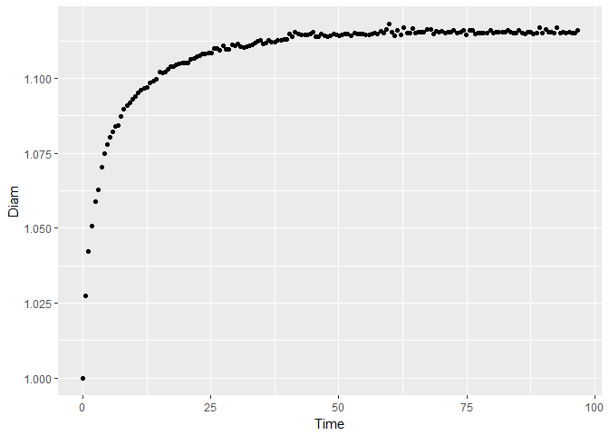

``` r
#regression for Diam vs Time#
m <- nls(Diam ~ 1+b*(1-exp(-Time/a)),start=list(a=1,b=1), data=CAM)
m
```

    ## Nonlinear regression model
    ##   model: Diam ~ 1 + b * (1 - exp(-Time/a))
    ##    data: CAM
    ##      a      b 
    ## 4.7260 0.1133 
    ##  residual sum-of-squares: 0.003012
    ## 
    ## Number of iterations to convergence: 12 
    ## Achieved convergence tolerance: 8.668e-06

``` r
#plot for Diam vs time#
Diamplot1<-ggplot(data=CAM, aes(x=Time,y=Diam))+
  geom_point()+
  geom_smooth(method="nls", 
              formula=y~1+b*(1-exp(-x/a)),
              method.args=list(start=c(a=1, b=1)),
              se=FALSE,
              data=CAM,
              color="red")

print(Diamplot1)
```

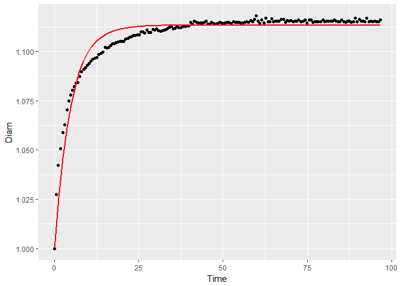

``` r
#Coefficient of Correlation for Diam vs Time model#
Rsquared_Diam <- cor(CAM$Diam, predict(m))

#generate table for regression parameters#
library(broom)
reg <- tidy(m)

#transform a parameter into range of regression#
a <- reg$estimate
a <- a[c(1)]
range <- 3*a

#make a variable for the b parameter for diameter vs time#
b <- reg$estimate
b <- b[c(2)]

#regression for CAO=(CA/Cao) vs Time#
m3 <- nls(CAO~1+e*(Time^f),start=list(e=1,f=1), data=CAM)
m3
```

    ## Nonlinear regression model
    ##   model: CAO ~ 1 + e * (Time^f)
    ##    data: CAM
    ##       e       f 
    ## -0.0709  0.2282 
    ##  residual sum-of-squares: 0.002379
    ## 
    ## Number of iterations to convergence: 9 
    ## Achieved convergence tolerance: 9.878e-06

``` r
#plot for m3#
CAOplot <- ggplot(data=CAM, aes(x=Time, y=CAO))+
  geom_point()+
  geom_smooth(method="nls",
              formula=y~1+(e*x^f),
              method.args=list(start=c(e=1, f=1)),
              se=FALSE)

print(CAOplot)
```

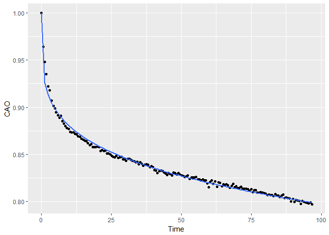

``` r
#Coefficient of correlation for CA/CAo vs Time (model=m3)#
Rsquared_CAO <- cor(CAM$CAO, predict(m3))

#generate table for regression parameters#
reg3<- tidy(m3)

e <- reg3$estimate
e <- e[c(1)]

f <- reg3$estimate
f <- f[c(2)]

#regression for CA using next method#
m4 <- nls(CAT~h*(Time^g)+1,start=list(h=1,g=1), data=CAM)
m4
```

    ## Nonlinear regression model
    ##   model: CAT ~ h * (Time^g) + 1
    ##    data: CAM
    ##       h       g 
    ## 0.07387 0.26691 
    ##  residual sum-of-squares: 0.00305
    ## 
    ## Number of iterations to convergence: 9 
    ## Achieved convergence tolerance: 2.377e-06

``` r
CATplot <- ggplot(data=CAM, aes(x=Time, y=CAT))+
  geom_point()+
  geom_smooth(method="nls",
              formula=y~1+(h*(x^g)),
              method.args=list(start=c(h=1, g=1)),
              se=FALSE)
print(CATplot)
```

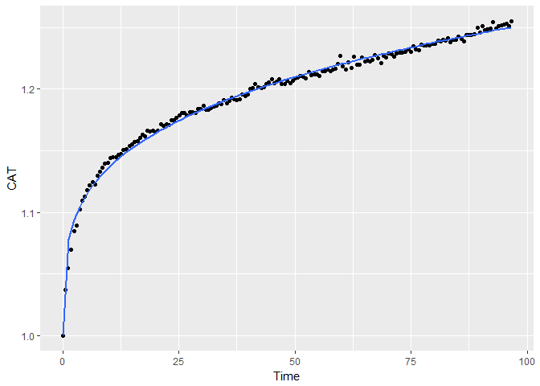

``` r
Rsquared_CAT <- cor(CAM$CAT, predict(m4))

#generate table or regression parameters#
reg4 <- tidy(m4)

h <- reg4$estimate
h <- h[c(1)]

g <- reg4$estimate
g <- g[c(2)]

#Fit CAeq using the range from Diam vs Time regression and the model m4#
CATeq <- (Co)/(1+(h*(range^g)))

#Fit CAeq using the range from Diam vs Time regression and the model m3#
CAOeq <- (1+e*range^f)*(Co)

#Store the information for this rep in a data frame#
CM_S1_2B <- data.frame(range, b, e, f, g, h, Rsquared_Diam, Rsquared_CAO, Rsquared_CAT, CAOeq, CATeq)

#Pull the data from the desktop#
cadata <- readxl::read_excel("CM-S1-2C_FINAL.xlsx")
cadata <- data.frame(cadata)

#Select on the variables of CA, Time, and Diameter#
CAM <- data.frame(CA=c(cadata$Var.6), Time=c(cadata$Var.13), Diam=c(cadata$Var.11))

#Select only the values in the column which are numeric#
CAM <- CAM[!is.na(as.numeric(as.character(CAM$CA))), ]
```

    ## Warning in `[.data.frame`(CAM, !is.na(as.numeric(as.character(CAM$CA))), :
    ## NAs introduced by coercion

``` r
#Transform the data back into numbers, extract CAo (Co)#
CA<-c(as.numeric(levels(CAM$CA))[CAM$CA])
```

    ## Warning: NAs introduced by coercion

``` r
Time<-c(as.numeric(levels(CAM$Time))[CAM$Time])
```

    ## Warning: NAs introduced by coercion

``` r
Diam<-c(as.numeric(levels(CAM$Diam))[CAM$Diam])
```

    ## Warning: NAs introduced by coercion

``` r
Co<-CA[c(1)]
Do<-Diam[c(1)]

Diam <- c(Diam/Do)
CAT <- c(Co/CA)
CAO <- c(CA/Co)

CAM <- data.frame(CA=c(CA), Time=c(Time), Diam=c(Diam), CAO=c(CAO), CAT=c(CAT))

#Plot raw data Diameter vs Time#
library(ggplot2)
Diamplot <- ggplot(CAM, aes(Time, Diam))+
  geom_point()

print(Diamplot)
```


``` r
#regression for Diam vs Time#
m <- nls(Diam ~ 1+b*(1-exp(-Time/a)),start=list(a=1,b=1), data=CAM)
m
```

    ## Nonlinear regression model
    ##   model: Diam ~ 1 + b * (1 - exp(-Time/a))
    ##    data: CAM
    ##      a      b 
    ## 4.2703 0.1201 
    ##  residual sum-of-squares: 0.002749
    ## 
    ## Number of iterations to convergence: 11 
    ## Achieved convergence tolerance: 5.271e-06

``` r
#plot for Diam vs time#
Diamplot1<-ggplot(data=CAM, aes(x=Time,y=Diam))+
  geom_point()+
  geom_smooth(method="nls", 
              formula=y~1+b*(1-exp(-x/a)),
              method.args=list(start=c(a=1, b=1)),
              se=FALSE,
              data=CAM,
              color="red")

print(Diamplot1)
```

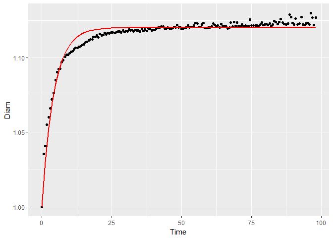

``` r
#Coefficient of Correlation for Diam vs Time model#
Rsquared_Diam <- cor(CAM$Diam, predict(m))

#generate table for regression parameters#
library(broom)
reg <- tidy(m)

#transform a parameter into range of regression#
a <- reg$estimate
a <- a[c(1)]
range <- 3*a

#make a variable for the b parameter for diameter vs time#
b <- reg$estimate
b <- b[c(2)]

#regression for CAO=(CA/Cao) vs Time#
m3 <- nls(CAO~1+e*(Time^f),start=list(e=1,f=1), data=CAM)
m3
```

    ## Nonlinear regression model
    ##   model: CAO ~ 1 + e * (Time^f)
    ##    data: CAM
    ##        e        f 
    ## -0.07548  0.21759 
    ##  residual sum-of-squares: 0.004453
    ## 
    ## Number of iterations to convergence: 9 
    ## Achieved convergence tolerance: 1.565e-06

``` r
#plot for m3#
CAOplot <- ggplot(data=CAM, aes(x=Time, y=CAO))+
  geom_point()+
  geom_smooth(method="nls",
              formula=y~1+(e*x^f),
              method.args=list(start=c(e=1, f=1)),
              se=FALSE)

print(CAOplot)
```

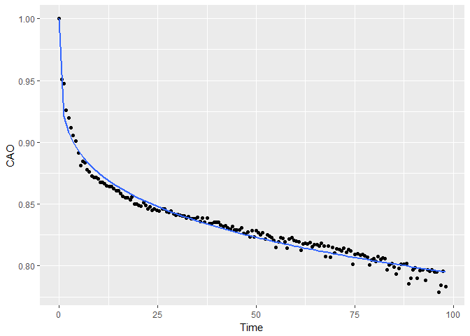

``` r
#Coefficient of correlation for CA/CAo vs Time (model=m3)#
Rsquared_CAO <- cor(CAM$CAO, predict(m3))

#generate table for regression parameters#
reg3<- tidy(m3)

e <- reg3$estimate
e <- e[c(1)]

f <- reg3$estimate
f <- f[c(2)]

#regression for CA using next method#
m4 <- nls(CAT~h*(Time^g)+1,start=list(h=1,g=1), data=CAM)
m4
```

    ## Nonlinear regression model
    ##   model: CAT ~ h * (Time^g) + 1
    ##    data: CAM
    ##       h       g 
    ## 0.07863 0.25753 
    ##  residual sum-of-squares: 0.008713
    ## 
    ## Number of iterations to convergence: 8 
    ## Achieved convergence tolerance: 4.604e-06

``` r
CATplot <- ggplot(data=CAM, aes(x=Time, y=CAT))+
  geom_point()+
  geom_smooth(method="nls",
              formula=y~1+(h*(x^g)),
              method.args=list(start=c(h=1, g=1)),
              se=FALSE)
print(CATplot)
```

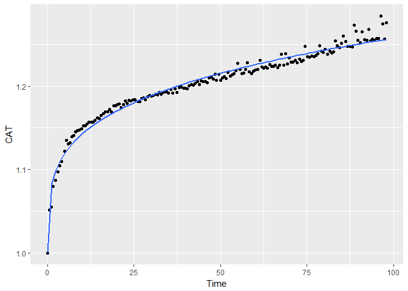

``` r
Rsquared_CAT <- cor(CAM$CAT, predict(m4))

#generate table or regression parameters#
reg4 <- tidy(m4)

h <- reg4$estimate
h <- h[c(1)]

g <- reg4$estimate
g <- g[c(2)]

#Fit CAeq using the range from Diam vs Time regression and the model m4#
CATeq <- (Co)/(1+(h*(range^g)))

#Fit CAeq using the range from Diam vs Time regression and the model m3#
CAOeq <- (1+e*range^f)*(Co)

#Store the information for this rep in a data frame#
CM_S1_2C <- data.frame(range, b, e, f, g, h, Rsquared_Diam, Rsquared_CAO, Rsquared_CAT, CAOeq, CATeq)

#Pull the data from the desktop#
cadata <- readxl::read_excel("CM-S2-1A_FINAL.xlsx")
cadata <- data.frame(cadata)

#Select on the variables of CA, Time, and Diameter#
CAM <- data.frame(CA=c(cadata$Var.6), Time=c(cadata$Var.13), Diam=c(cadata$Var.11))

#Select only the values in the column which are numeric#
CAM <- CAM[!is.na(as.numeric(as.character(CAM$CA))), ]
```

    ## Warning in `[.data.frame`(CAM, !is.na(as.numeric(as.character(CAM$CA))), :
    ## NAs introduced by coercion

``` r
#Transform the data back into numbers, extract CAo (Co)#
CA<-c(as.numeric(levels(CAM$CA))[CAM$CA])
```

    ## Warning: NAs introduced by coercion

``` r
Time<-c(as.numeric(levels(CAM$Time))[CAM$Time])
```

    ## Warning: NAs introduced by coercion

``` r
Diam<-c(as.numeric(levels(CAM$Diam))[CAM$Diam])
```

    ## Warning: NAs introduced by coercion

``` r
Co<-CA[c(1)]
Do<-Diam[c(1)]

Diam <- c(Diam/Do)
CAT <- c(Co/CA)
CAO <- c(CA/Co)

CAM <- data.frame(CA=c(CA), Time=c(Time), Diam=c(Diam), CAO=c(CAO), CAT=c(CAT))

#Plot raw data Diameter vs Time#
library(ggplot2)
Diamplot <- ggplot(CAM, aes(Time, Diam))+
  geom_point()

print(Diamplot)
```

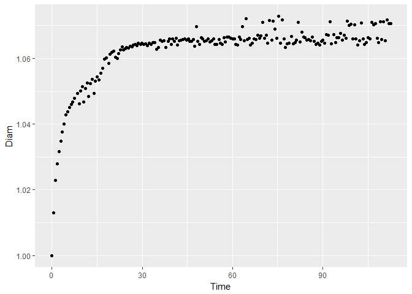

``` r
#regression for Diam vs Time#
m <- nls(Diam ~ 1+b*(1-exp(-Time/a)),start=list(a=1,b=1), data=CAM)
m
```

    ## Nonlinear regression model
    ##   model: Diam ~ 1 + b * (1 - exp(-Time/a))
    ##    data: CAM
    ##       a       b 
    ## 6.10027 0.06582 
    ##  residual sum-of-squares: 0.002178
    ## 
    ## Number of iterations to convergence: 13 
    ## Achieved convergence tolerance: 5.033e-06

``` r
#plot for Diam vs time#
Diamplot1<-ggplot(data=CAM, aes(x=Time,y=Diam))+
  geom_point()+
  geom_smooth(method="nls", 
              formula=y~1+b*(1-exp(-x/a)),
              method.args=list(start=c(a=1, b=1)),
              se=FALSE,
              data=CAM,
              color="red")

print(Diamplot1)
```

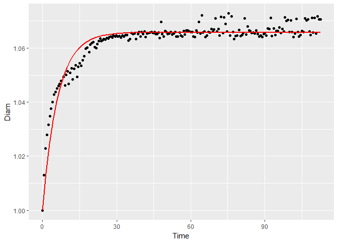

``` r
#Coefficient of Correlation for Diam vs Time model#
Rsquared_Diam <- cor(CAM$Diam, predict(m))

#generate table for regression parameters#
library(broom)
reg <- tidy(m)

#transform a parameter into range of regression#
a <- reg$estimate
a <- a[c(1)]
range <- 3*a

#make a variable for the b parameter for diameter vs time#
b <- reg$estimate
b <- b[c(2)]

#regression for CAO=(CA/Cao) vs Time#
m3 <- nls(CAO~1+e*(Time^f),start=list(e=1,f=1), data=CAM)
m3
```

    ## Nonlinear regression model
    ##   model: CAO ~ 1 + e * (Time^f)
    ##    data: CAM
    ##        e        f 
    ## -0.03097  0.37290 
    ##  residual sum-of-squares: 0.007984
    ## 
    ## Number of iterations to convergence: 9 
    ## Achieved convergence tolerance: 5.156e-07

``` r
#plot for m3#
CAOplot <- ggplot(data=CAM, aes(x=Time, y=CAO))+
  geom_point()+
  geom_smooth(method="nls",
              formula=y~1+(e*x^f),
              method.args=list(start=c(e=1, f=1)),
              se=FALSE)

print(CAOplot)
```

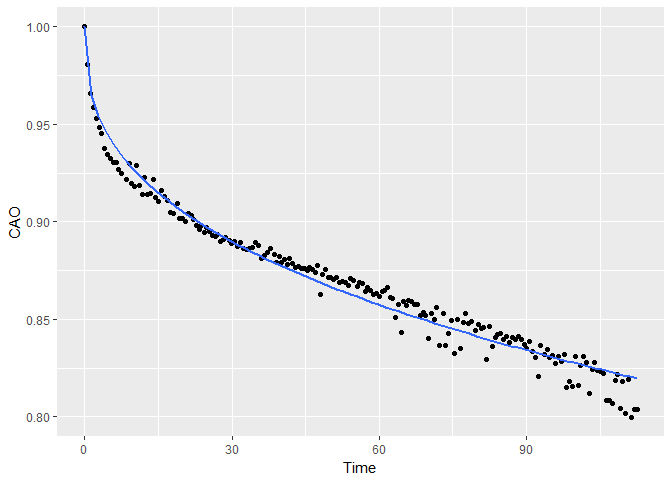

``` r
#Coefficient of correlation for CA/CAo vs Time (model=m3)#
Rsquared_CAO <- cor(CAM$CAO, predict(m3))

#generate table for regression parameters#
reg3<- tidy(m3)

e <- reg3$estimate
e <- e[c(1)]

f <- reg3$estimate
f <- f[c(2)]

#regression for CA using next method#
m4 <- nls(CAT~h*(Time^g)+1,start=list(h=1,g=1), data=CAM)
m4
```

    ## Nonlinear regression model
    ##   model: CAT ~ h * (Time^g) + 1
    ##    data: CAM
    ##       h       g 
    ## 0.02814 0.43496 
    ##  residual sum-of-squares: 0.01724
    ## 
    ## Number of iterations to convergence: 9 
    ## Achieved convergence tolerance: 8.675e-07

``` r
CATplot <- ggplot(data=CAM, aes(x=Time, y=CAT))+
  geom_point()+
  geom_smooth(method="nls",
              formula=y~1+(h*(x^g)),
              method.args=list(start=c(h=1, g=1)),
              se=FALSE)
print(CATplot)
```

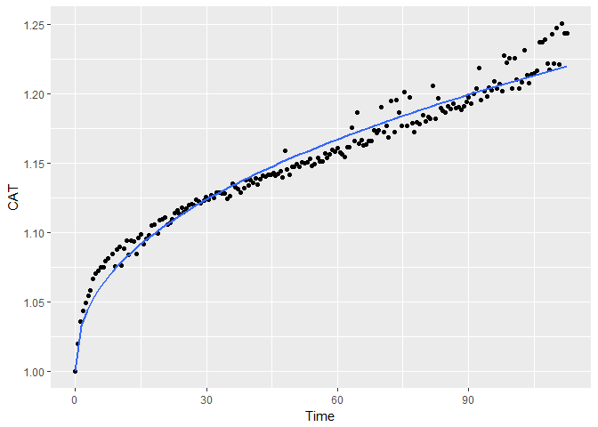

``` r
Rsquared_CAT <- cor(CAM$CAT, predict(m4))

#generate table or regression parameters#
reg4 <- tidy(m4)

h <- reg4$estimate
h <- h[c(1)]

g <- reg4$estimate
g <- g[c(2)]

#Fit CAeq using the range from Diam vs Time regression and the model m4#
CATeq <- (Co)/(1+(h*(range^g)))

#Fit CAeq using the range from Diam vs Time regression and the model m3#
CAOeq <- (1+e*range^f)*(Co)

#Store the information for this rep in a data frame#
CM_S2_1A <- data.frame(range, b, e, f, g, h, Rsquared_Diam, Rsquared_CAO, Rsquared_CAT, CAOeq, CATeq)

#Pull the data from the desktop#
cadata <- readxl::read_excel("CM-S2-1B_FINAL.xlsx")
cadata <- data.frame(cadata)

#Select on the variables of CA, Time, and Diameter#
CAM <- data.frame(CA=c(cadata$Var.6), Time=c(cadata$Var.13), Diam=c(cadata$Var.11))

#Select only the values in the column which are numeric#
CAM <- CAM[!is.na(as.numeric(as.character(CAM$CA))), ]
```

    ## Warning in `[.data.frame`(CAM, !is.na(as.numeric(as.character(CAM$CA))), :
    ## NAs introduced by coercion

``` r
#Transform the data back into numbers, extract CAo (Co)#
CA<-c(as.numeric(levels(CAM$CA))[CAM$CA])
```

    ## Warning: NAs introduced by coercion

``` r
Time<-c(as.numeric(levels(CAM$Time))[CAM$Time])
```

    ## Warning: NAs introduced by coercion

``` r
Diam<-c(as.numeric(levels(CAM$Diam))[CAM$Diam])
```

    ## Warning: NAs introduced by coercion

``` r
Co<-CA[c(1)]
Do<-Diam[c(1)]

Diam <- c(Diam/Do)
CAT <- c(Co/CA)
CAO <- c(CA/Co)

CAM <- data.frame(CA=c(CA), Time=c(Time), Diam=c(Diam), CAO=c(CAO), CAT=c(CAT))

#Plot raw data Diameter vs Time#
library(ggplot2)
Diamplot <- ggplot(CAM, aes(Time, Diam))+
  geom_point()

print(Diamplot)
```

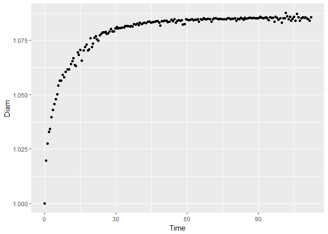

``` r
#regression for Diam vs Time#
m <- nls(Diam ~ 1+b*(1-exp(-Time/a)),start=list(a=1,b=1), data=CAM)
m
```

    ## Nonlinear regression model
    ##   model: Diam ~ 1 + b * (1 - exp(-Time/a))
    ##    data: CAM
    ##       a       b 
    ## 6.88430 0.08359 
    ##  residual sum-of-squares: 0.002074
    ## 
    ## Number of iterations to convergence: 12 
    ## Achieved convergence tolerance: 9.832e-06

``` r
#plot for Diam vs time#
Diamplot1<-ggplot(data=CAM, aes(x=Time,y=Diam))+
  geom_point()+
  geom_smooth(method="nls", 
              formula=y~1+b*(1-exp(-x/a)),
              method.args=list(start=c(a=1, b=1)),
              se=FALSE,
              data=CAM,
              color="red")

print(Diamplot1)
```

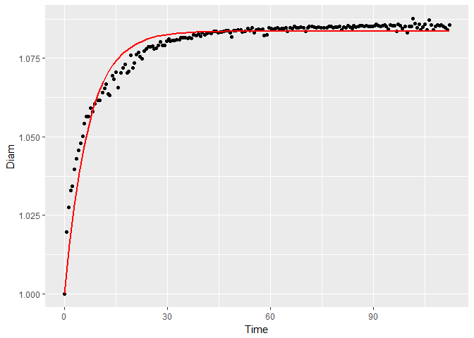

``` r
#Coefficient of Correlation for Diam vs Time model#
Rsquared_Diam <- cor(CAM$Diam, predict(m))

#generate table for regression parameters#
library(broom)
reg <- tidy(m)

#transform a parameter into range of regression#
a <- reg$estimate
a <- a[c(1)]
range <- 3*a

#make a variable for the b parameter for diameter vs time#
b <- reg$estimate
b <- b[c(2)]

#regression for CAO=(CA/Cao) vs Time#
m3 <- nls(CAO~1+e*(Time^f),start=list(e=1,f=1), data=CAM)
m3
```

    ## Nonlinear regression model
    ##   model: CAO ~ 1 + e * (Time^f)
    ##    data: CAM
    ##       e       f 
    ## -0.0449  0.2763 
    ##  residual sum-of-squares: 0.001902
    ## 
    ## Number of iterations to convergence: 9 
    ## Achieved convergence tolerance: 7.382e-06

``` r
#plot for m3#
CAOplot <- ggplot(data=CAM, aes(x=Time, y=CAO))+
  geom_point()+
  geom_smooth(method="nls",
              formula=y~1+(e*x^f),
              method.args=list(start=c(e=1, f=1)),
              se=FALSE)

print(CAOplot)
```


``` r
#Coefficient of correlation for CA/CAo vs Time (model=m3)#
Rsquared_CAO <- cor(CAM$CAO, predict(m3))

#generate table for regression parameters#
reg3<- tidy(m3)

e <- reg3$estimate
e <- e[c(1)]

f <- reg3$estimate
f <- f[c(2)]

#regression for CA using next method#
m4 <- nls(CAT~h*(Time^g)+1,start=list(h=1,g=1), data=CAM)
m4
```

    ## Nonlinear regression model
    ##   model: CAT ~ h * (Time^g) + 1
    ##    data: CAM
    ##       h       g 
    ## 0.04518 0.31201 
    ##  residual sum-of-squares: 0.002437
    ## 
    ## Number of iterations to convergence: 9 
    ## Achieved convergence tolerance: 1.956e-06

``` r
CATplot <- ggplot(data=CAM, aes(x=Time, y=CAT))+
  geom_point()+
  geom_smooth(method="nls",
              formula=y~1+(h*(x^g)),
              method.args=list(start=c(h=1, g=1)),
              se=FALSE)
print(CATplot)
```

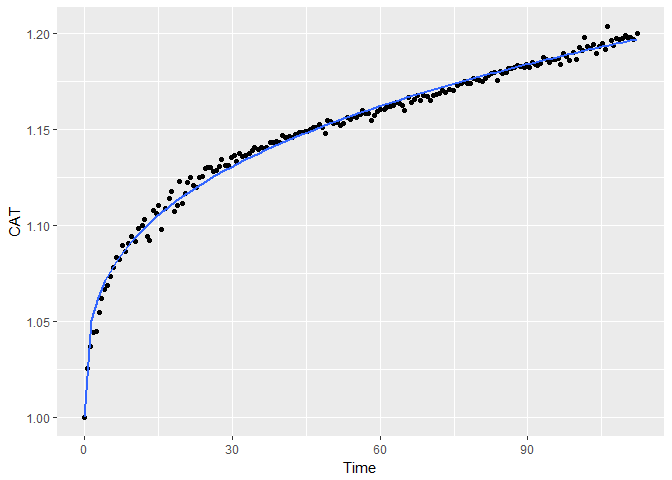

``` r
Rsquared_CAT <- cor(CAM$CAT, predict(m4))

#generate table or regression parameters#
reg4 <- tidy(m4)

h <- reg4$estimate
h <- h[c(1)]

g <- reg4$estimate
g <- g[c(2)]

#Fit CAeq using the range from Diam vs Time regression and the model m4#
CATeq <- (Co)/(1+(h*(range^g)))

#Fit CAeq using the range from Diam vs Time regression and the model m3#
CAOeq <- (1+e*range^f)*(Co)

#Store the information for this rep in a data frame#
CM_S2_1B <- data.frame(range, b, e, f, g, h, Rsquared_Diam, Rsquared_CAO, Rsquared_CAT, CAOeq, CATeq)

#Pull the data from the desktop#
cadata <- readxl::read_excel("CM-S2-1C_FINAL.xlsx")
cadata <- data.frame(cadata)

#Select on the variables of CA, Time, and Diameter#
CAM <- data.frame(CA=c(cadata$Var.6), Time=c(cadata$Var.13), Diam=c(cadata$Var.11))

#Select only the values in the column which are numeric#
CAM <- CAM[!is.na(as.numeric(as.character(CAM$CA))), ]
```

    ## Warning in `[.data.frame`(CAM, !is.na(as.numeric(as.character(CAM$CA))), :
    ## NAs introduced by coercion

``` r
#Transform the data back into numbers, extract CAo (Co)#
CA<-c(as.numeric(levels(CAM$CA))[CAM$CA])
```

    ## Warning: NAs introduced by coercion

``` r
Time<-c(as.numeric(levels(CAM$Time))[CAM$Time])
```

    ## Warning: NAs introduced by coercion

``` r
Diam<-c(as.numeric(levels(CAM$Diam))[CAM$Diam])
```

    ## Warning: NAs introduced by coercion

``` r
Co<-CA[c(1)]
Do<-Diam[c(1)]

Diam <- c(Diam/Do)
CAT <- c(Co/CA)
CAO <- c(CA/Co)

CAM <- data.frame(CA=c(CA), Time=c(Time), Diam=c(Diam), CAO=c(CAO), CAT=c(CAT))

#Plot raw data Diameter vs Time#
library(ggplot2)
Diamplot <- ggplot(CAM, aes(Time, Diam))+
  geom_point()

print(Diamplot)
```

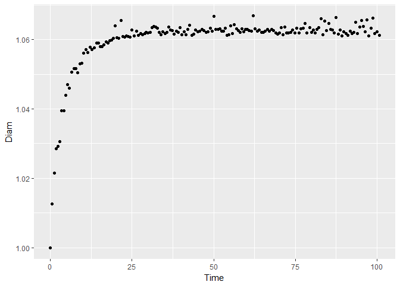

``` r
#regression for Diam vs Time#
m <- nls(Diam ~ 1+b*(1-exp(-Time/a)),start=list(a=1,b=1), data=CAM)
m
```

    ## Nonlinear regression model
    ##   model: Diam ~ 1 + b * (1 - exp(-Time/a))
    ##    data: CAM
    ##      a      b 
    ## 4.0819 0.0624 
    ##  residual sum-of-squares: 0.0004606
    ## 
    ## Number of iterations to convergence: 9 
    ## Achieved convergence tolerance: 5.886e-06

``` r
#plot for Diam vs time#
Diamplot1<-ggplot(data=CAM, aes(x=Time,y=Diam))+
  geom_point()+
  geom_smooth(method="nls", 
              formula=y~1+b*(1-exp(-x/a)),
              method.args=list(start=c(a=1, b=1)),
              se=FALSE,
              data=CAM,
              color="red")

print(Diamplot1)
```

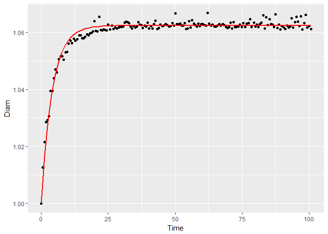

``` r
#Coefficient of Correlation for Diam vs Time model#
Rsquared_Diam <- cor(CAM$Diam, predict(m))

#generate table for regression parameters#
library(broom)
reg <- tidy(m)

#transform a parameter into range of regression#
a <- reg$estimate
a <- a[c(1)]
range <- 3*a

#make a variable for the b parameter for diameter vs time#
b <- reg$estimate
b <- b[c(2)]

#regression for CAO=(CA/Cao) vs Time#
m3 <- nls(CAO~1+e*(Time^f),start=list(e=1,f=1), data=CAM)
m3
```

    ## Nonlinear regression model
    ##   model: CAO ~ 1 + e * (Time^f)
    ##    data: CAM
    ##        e        f 
    ## -0.02953  0.33824 
    ##  residual sum-of-squares: 0.003668
    ## 
    ## Number of iterations to convergence: 8 
    ## Achieved convergence tolerance: 1.886e-06

``` r
#plot for m3#
CAOplot <- ggplot(data=CAM, aes(x=Time, y=CAO))+
  geom_point()+
  geom_smooth(method="nls",
              formula=y~1+(e*x^f),
              method.args=list(start=c(e=1, f=1)),
              se=FALSE)

print(CAOplot)
```

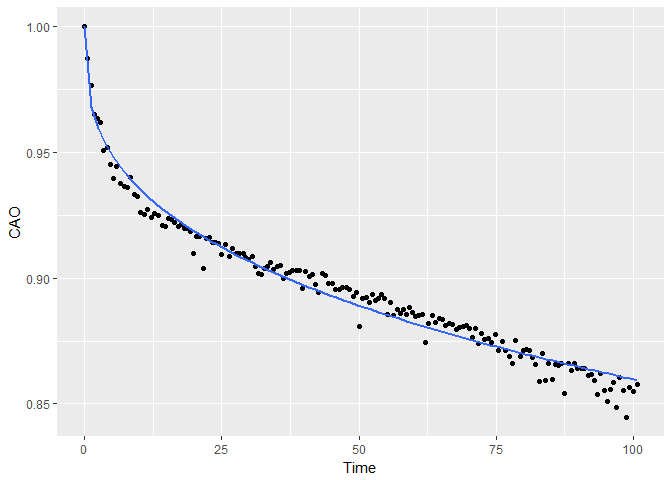

``` r
#Coefficient of correlation for CA/CAo vs Time (model=m3)#
Rsquared_CAO <- cor(CAM$CAO, predict(m3))

#generate table for regression parameters#
reg3<- tidy(m3)

e <- reg3$estimate
e <- e[c(1)]

f <- reg3$estimate
f <- f[c(2)]

#regression for CA using next method#
m4 <- nls(CAT~h*(Time^g)+1,start=list(h=1,g=1), data=CAM)
m4
```

    ## Nonlinear regression model
    ##   model: CAT ~ h * (Time^g) + 1
    ##    data: CAM
    ##       h       g 
    ## 0.02843 0.37880 
    ##  residual sum-of-squares: 0.006243
    ## 
    ## Number of iterations to convergence: 8 
    ## Achieved convergence tolerance: 7.148e-06

``` r
CATplot <- ggplot(data=CAM, aes(x=Time, y=CAT))+
  geom_point()+
  geom_smooth(method="nls",
              formula=y~1+(h*(x^g)),
              method.args=list(start=c(h=1, g=1)),
              se=FALSE)
print(CATplot)
```

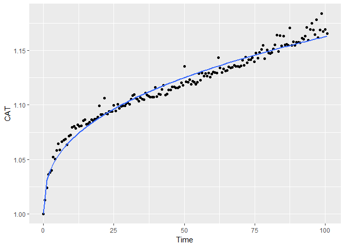

``` r
Rsquared_CAT <- cor(CAM$CAT, predict(m4))

#generate table or regression parameters#
reg4 <- tidy(m4)

h <- reg4$estimate
h <- h[c(1)]

g <- reg4$estimate
g <- g[c(2)]

#Fit CAeq using the range from Diam vs Time regression and the model m4#
CATeq <- (Co)/(1+(h*(range^g)))

#Fit CAeq using the range from Diam vs Time regression and the model m3#
CAOeq <- (1+e*range^f)*(Co)

#Store the information for this rep in a data frame#
CM_S2_1C <- data.frame(range, b, e, f, g, h, Rsquared_Diam, Rsquared_CAO, Rsquared_CAT, CAOeq, CATeq)

#Pull the data from the desktop#
cadata <- readxl::read_excel("CM-S2-2A_FINAL.xlsx")
cadata <- data.frame(cadata)

#Select on the variables of CA, Time, and Diameter#
CAM <- data.frame(CA=c(cadata$Var.6), Time=c(cadata$Var.13), Diam=c(cadata$Var.11))

#Select only the values in the column which are numeric#
CAM <- CAM[!is.na(as.numeric(as.character(CAM$CA))), ]
```

    ## Warning in `[.data.frame`(CAM, !is.na(as.numeric(as.character(CAM$CA))), :
    ## NAs introduced by coercion

``` r
#Transform the data back into numbers, extract CAo (Co)#
CA<-c(as.numeric(levels(CAM$CA))[CAM$CA])
```

    ## Warning: NAs introduced by coercion

``` r
Time<-c(as.numeric(levels(CAM$Time))[CAM$Time])
```

    ## Warning: NAs introduced by coercion

``` r
Diam<-c(as.numeric(levels(CAM$Diam))[CAM$Diam])
```

    ## Warning: NAs introduced by coercion

``` r
Co<-CA[c(1)]
Do<-Diam[c(1)]

Diam <- c(Diam/Do)
CAT <- c(Co/CA)
CAO <- c(CA/Co)

CAM <- data.frame(CA=c(CA), Time=c(Time), Diam=c(Diam), CAO=c(CAO), CAT=c(CAT))

#Plot raw data Diameter vs Time#
library(ggplot2)
Diamplot <- ggplot(CAM, aes(Time, Diam))+
  geom_point()

print(Diamplot)
```

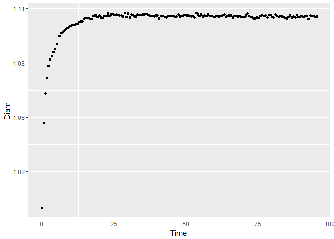

``` r
#regression for Diam vs Time#
m <- nls(Diam ~ 1+b*(1-exp(-Time/a)),start=list(a=1,b=1), data=CAM)
m
```

    ## Nonlinear regression model
    ##   model: Diam ~ 1 + b * (1 - exp(-Time/a))
    ##    data: CAM
    ##      a      b 
    ## 1.6689 0.1052 
    ##  residual sum-of-squares: 0.001279
    ## 
    ## Number of iterations to convergence: 12 
    ## Achieved convergence tolerance: 3.986e-06

``` r
#plot for Diam vs time#
Diamplot1<-ggplot(data=CAM, aes(x=Time,y=Diam))+
  geom_point()+
  geom_smooth(method="nls", 
              formula=y~1+b*(1-exp(-x/a)),
              method.args=list(start=c(a=1, b=1)),
              se=FALSE,
              data=CAM,
              color="red")

print(Diamplot1)
```

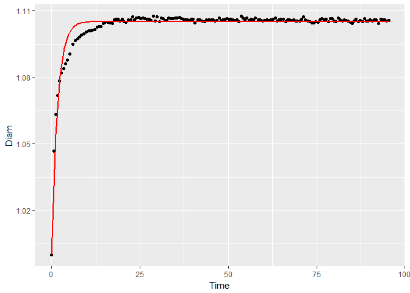

``` r
#Coefficient of Correlation for Diam vs Time model#
Rsquared_Diam <- cor(CAM$Diam, predict(m))

#generate table for regression parameters#
library(broom)
reg <- tidy(m)

#transform a parameter into range of regression#
a <- reg$estimate
a <- a[c(1)]
range <- 3*a

#make a variable for the b parameter for diameter vs time#
b <- reg$estimate
b <- b[c(2)]

#regression for CAO=(CA/Cao) vs Time#
m3 <- nls(CAO~1+e*(Time^f),start=list(e=1,f=1), data=CAM)
m3
```

    ## Nonlinear regression model
    ##   model: CAO ~ 1 + e * (Time^f)
    ##    data: CAM
    ##        e        f 
    ## -0.07888  0.21633 
    ##  residual sum-of-squares: 0.003322
    ## 
    ## Number of iterations to convergence: 9 
    ## Achieved convergence tolerance: 1.236e-06

``` r
#plot for m3#
CAOplot <- ggplot(data=CAM, aes(x=Time, y=CAO))+
  geom_point()+
  geom_smooth(method="nls",
              formula=y~1+(e*x^f),
              method.args=list(start=c(e=1, f=1)),
              se=FALSE)

print(CAOplot)
```

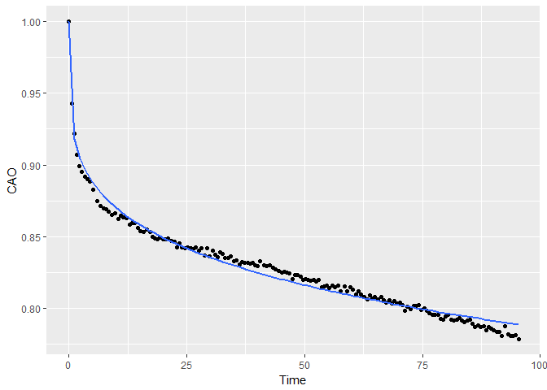

``` r
#Coefficient of correlation for CA/CAo vs Time (model=m3)#
Rsquared_CAO <- cor(CAM$CAO, predict(m3))

#generate table for regression parameters#
reg3<- tidy(m3)

e <- reg3$estimate
e <- e[c(1)]

f <- reg3$estimate
f <- f[c(2)]

#regression for CA using next method#
m4 <- nls(CAT~h*(Time^g)+1,start=list(h=1,g=1), data=CAM)
m4
```

    ## Nonlinear regression model
    ##   model: CAT ~ h * (Time^g) + 1
    ##    data: CAM
    ##       h       g 
    ## 0.08102 0.26215 
    ##  residual sum-of-squares: 0.008316
    ## 
    ## Number of iterations to convergence: 9 
    ## Achieved convergence tolerance: 5.719e-07

``` r
CATplot <- ggplot(data=CAM, aes(x=Time, y=CAT))+
  geom_point()+
  geom_smooth(method="nls",
              formula=y~1+(h*(x^g)),
              method.args=list(start=c(h=1, g=1)),
              se=FALSE)
print(CATplot)
```

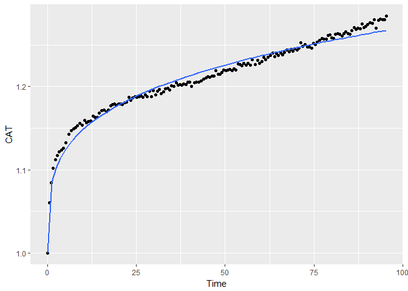

``` r
Rsquared_CAT <- cor(CAM$CAT, predict(m4))

#generate table or regression parameters#
reg4 <- tidy(m4)

h <- reg4$estimate
h <- h[c(1)]

g <- reg4$estimate
g <- g[c(2)]

#Fit CAeq using the range from Diam vs Time regression and the model m4#
CATeq <- (Co)/(1+(h*(range^g)))

#Fit CAeq using the range from Diam vs Time regression and the model m3#
CAOeq <- (1+e*range^f)*(Co)

#Store the information for this rep in a data frame#
CM_S2_2A <- data.frame(range, b, e, f, g, h, Rsquared_Diam, Rsquared_CAO, Rsquared_CAT, CAOeq, CATeq)

#Pull the data from the desktop#
cadata <- readxl::read_excel("CM-S2-2B_FINAL.xlsx")
cadata <- data.frame(cadata)

#Select on the variables of CA, Time, and Diameter#
CAM <- data.frame(CA=c(cadata$Var.6), Time=c(cadata$Var.13), Diam=c(cadata$Var.11))

#Select only the values in the column which are numeric#
CAM <- CAM[!is.na(as.numeric(as.character(CAM$CA))), ]
```

    ## Warning in `[.data.frame`(CAM, !is.na(as.numeric(as.character(CAM$CA))), :
    ## NAs introduced by coercion

``` r
#Transform the data back into numbers, extract CAo (Co)#
CA<-c(as.numeric(levels(CAM$CA))[CAM$CA])
```

    ## Warning: NAs introduced by coercion

``` r
Time<-c(as.numeric(levels(CAM$Time))[CAM$Time])
```

    ## Warning: NAs introduced by coercion

``` r
Diam<-c(as.numeric(levels(CAM$Diam))[CAM$Diam])
```

    ## Warning: NAs introduced by coercion

``` r
Co<-CA[c(1)]
Do<-Diam[c(1)]

Diam <- c(Diam/Do)
CAT <- c(Co/CA)
CAO <- c(CA/Co)

CAM <- data.frame(CA=c(CA), Time=c(Time), Diam=c(Diam), CAO=c(CAO), CAT=c(CAT))

#Plot raw data Diameter vs Time#
library(ggplot2)
Diamplot <- ggplot(CAM, aes(Time, Diam))+
  geom_point()

print(Diamplot)
```

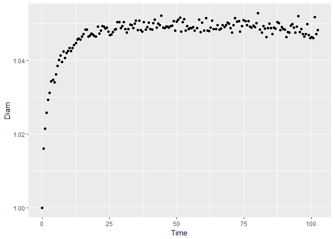

``` r
#regression for Diam vs Time#
m <- nls(Diam ~ 1+b*(1-exp(-Time/a)),start=list(a=1,b=1), data=CAM)
m
```

    ## Nonlinear regression model
    ##   model: Diam ~ 1 + b * (1 - exp(-Time/a))
    ##    data: CAM
    ##       a       b 
    ## 3.23785 0.04873 
    ##  residual sum-of-squares: 0.0006574
    ## 
    ## Number of iterations to convergence: 12 
    ## Achieved convergence tolerance: 5.016e-06

``` r
#plot for Diam vs time#
Diamplot1<-ggplot(data=CAM, aes(x=Time,y=Diam))+
  geom_point()+
  geom_smooth(method="nls", 
              formula=y~1+b*(1-exp(-x/a)),
              method.args=list(start=c(a=1, b=1)),
              se=FALSE,
              data=CAM,
              color="red")

print(Diamplot1)
```

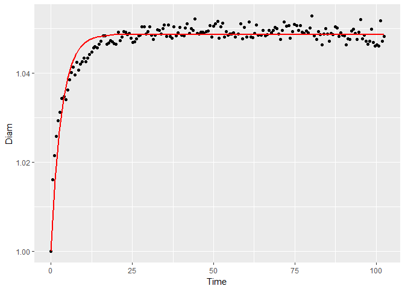

``` r
#Coefficient of Correlation for Diam vs Time model#
Rsquared_Diam <- cor(CAM$Diam, predict(m))

#generate table for regression parameters#
library(broom)
reg <- tidy(m)

#transform a parameter into range of regression#
a <- reg$estimate
a <- a[c(1)]
range <- 3*a

#make a variable for the b parameter for diameter vs time#
b <- reg$estimate
b <- b[c(2)]

#regression for CAO=(CA/Cao) vs Time#
m3 <- nls(CAO~1+e*(Time^f),start=list(e=1,f=1), data=CAM)
m3
```

    ## Nonlinear regression model
    ##   model: CAO ~ 1 + e * (Time^f)
    ##    data: CAM
    ##        e        f 
    ## -0.02993  0.33639 
    ##  residual sum-of-squares: 0.002528
    ## 
    ## Number of iterations to convergence: 8 
    ## Achieved convergence tolerance: 7.146e-06

``` r
#plot for m3#
CAOplot <- ggplot(data=CAM, aes(x=Time, y=CAO))+
  geom_point()+
  geom_smooth(method="nls",
              formula=y~1+(e*x^f),
              method.args=list(start=c(e=1, f=1)),
              se=FALSE)

print(CAOplot)
```

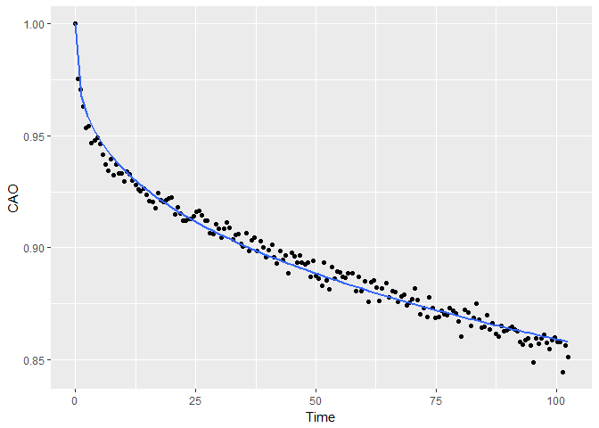

``` r
#Coefficient of correlation for CA/CAo vs Time (model=m3)#
Rsquared_CAO <- cor(CAM$CAO, predict(m3))

#generate table for regression parameters#
reg3<- tidy(m3)

e <- reg3$estimate
e <- e[c(1)]

f <- reg3$estimate
f <- f[c(2)]

#regression for CA using next method#
m4 <- nls(CAT~h*(Time^g)+1,start=list(h=1,g=1), data=CAM)
m4
```

    ## Nonlinear regression model
    ##   model: CAT ~ h * (Time^g) + 1
    ##    data: CAM
    ##       h       g 
    ## 0.02877 0.37756 
    ##  residual sum-of-squares: 0.004488
    ## 
    ## Number of iterations to convergence: 9 
    ## Achieved convergence tolerance: 4.222e-07

``` r
CATplot <- ggplot(data=CAM, aes(x=Time, y=CAT))+
  geom_point()+
  geom_smooth(method="nls",
              formula=y~1+(h*(x^g)),
              method.args=list(start=c(h=1, g=1)),
              se=FALSE)
print(CATplot)
```

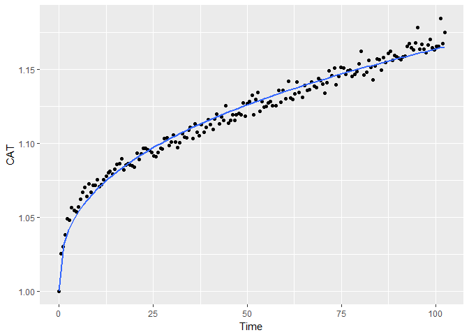

``` r
Rsquared_CAT <- cor(CAM$CAT, predict(m4))

#generate table or regression parameters#
reg4 <- tidy(m4)

h <- reg4$estimate
h <- h[c(1)]

g <- reg4$estimate
g <- g[c(2)]

#Fit CAeq using the range from Diam vs Time regression and the model m4#
CATeq <- (Co)/(1+(h*(range^g)))

#Fit CAeq using the range from Diam vs Time regression and the model m3#
CAOeq <- (1+e*range^f)*(Co)

#Store the information for this rep in a data frame#
CM_S2_2B <- data.frame(range, b, e, f, g, h, Rsquared_Diam, Rsquared_CAO, Rsquared_CAT, CAOeq, CATeq)

#Pull the data from the desktop#
cadata <- readxl::read_excel("CM-S2-2C_FINAL.xlsx")
cadata <- data.frame(cadata)

#Select on the variables of CA, Time, and Diameter#
CAM <- data.frame(CA=c(cadata$Var.6), Time=c(cadata$Var.13), Diam=c(cadata$Var.11))

#Select only the values in the column which are numeric#
CAM <- CAM[!is.na(as.numeric(as.character(CAM$CA))), ]
```

    ## Warning in `[.data.frame`(CAM, !is.na(as.numeric(as.character(CAM$CA))), :
    ## NAs introduced by coercion

``` r
#Transform the data back into numbers, extract CAo (Co)#
CA<-c(as.numeric(levels(CAM$CA))[CAM$CA])
```

    ## Warning: NAs introduced by coercion

``` r
Time<-c(as.numeric(levels(CAM$Time))[CAM$Time])
```

    ## Warning: NAs introduced by coercion

``` r
Diam<-c(as.numeric(levels(CAM$Diam))[CAM$Diam])
```

    ## Warning: NAs introduced by coercion

``` r
Co<-CA[c(1)]
Do<-Diam[c(1)]

Diam <- c(Diam/Do)
CAT <- c(Co/CA)
CAO <- c(CA/Co)

CAM <- data.frame(CA=c(CA), Time=c(Time), Diam=c(Diam), CAO=c(CAO), CAT=c(CAT))

#Plot raw data Diameter vs Time#
library(ggplot2)
Diamplot <- ggplot(CAM, aes(Time, Diam))+
  geom_point()

print(Diamplot)
```

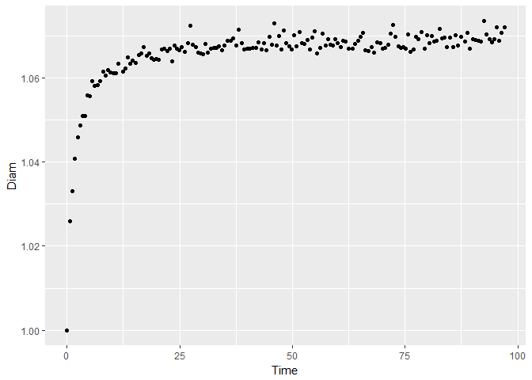

``` r
#regression for Diam vs Time#
m <- nls(Diam ~ 1+b*(1-exp(-Time/a)),start=list(a=1,b=1), data=CAM)
m
```

    ## Nonlinear regression model
    ##   model: Diam ~ 1 + b * (1 - exp(-Time/a))
    ##    data: CAM
    ##       a       b 
    ## 2.41652 0.06765 
    ##  residual sum-of-squares: 0.001092
    ## 
    ## Number of iterations to convergence: 11 
    ## Achieved convergence tolerance: 9.903e-06

``` r
#plot for Diam vs time#
Diamplot1<-ggplot(data=CAM, aes(x=Time,y=Diam))+
  geom_point()+
  geom_smooth(method="nls", 
              formula=y~1+b*(1-exp(-x/a)),
              method.args=list(start=c(a=1, b=1)),
              se=FALSE,
              data=CAM,
              color="red")

print(Diamplot1)
```

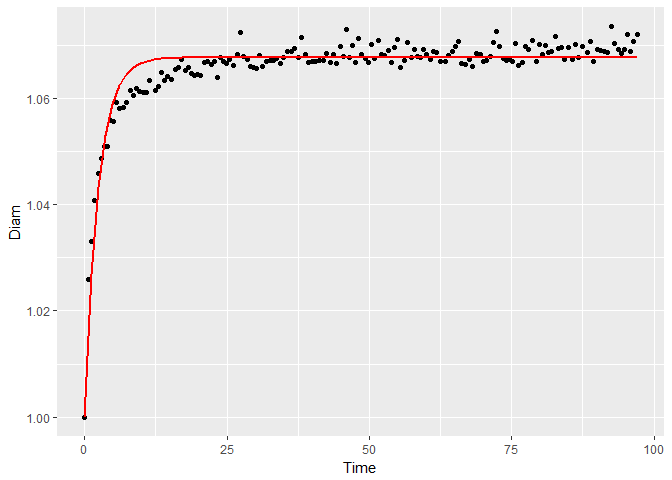

``` r
#Coefficient of Correlation for Diam vs Time model#
Rsquared_Diam <- cor(CAM$Diam, predict(m))

#generate table for regression parameters#
library(broom)
reg <- tidy(m)

#transform a parameter into range of regression#
a <- reg$estimate
a <- a[c(1)]
range <- 3*a

#make a variable for the b parameter for diameter vs time#
b <- reg$estimate
b <- b[c(2)]

#regression for CAO=(CA/Cao) vs Time#
m3 <- nls(CAO~1+e*(Time^f),start=list(e=1,f=1), data=CAM)
m3
```

    ## Nonlinear regression model
    ##   model: CAO ~ 1 + e * (Time^f)
    ##    data: CAM
    ##        e        f 
    ## -0.04603  0.31949 
    ##  residual sum-of-squares: 0.007597
    ## 
    ## Number of iterations to convergence: 9 
    ## Achieved convergence tolerance: 1.496e-06

``` r
#plot for m3#
CAOplot <- ggplot(data=CAM, aes(x=Time, y=CAO))+
  geom_point()+
  geom_smooth(method="nls",
              formula=y~1+(e*x^f),
              method.args=list(start=c(e=1, f=1)),
              se=FALSE)

print(CAOplot)
```

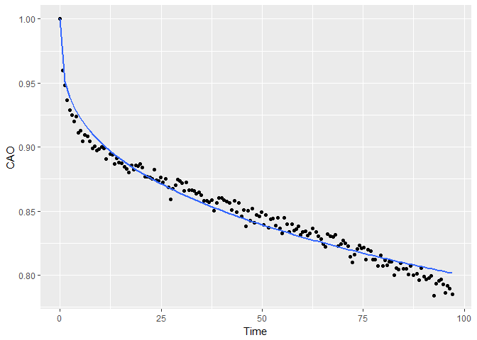

``` r
#Coefficient of correlation for CA/CAo vs Time (model=m3)#
Rsquared_CAO <- cor(CAM$CAO, predict(m3))

#generate table for regression parameters#
reg3<- tidy(m3)

e <- reg3$estimate
e <- e[c(1)]

f <- reg3$estimate
f <- f[c(2)]

#regression for CA using next method#
m4 <- nls(CAT~h*(Time^g)+1,start=list(h=1,g=1), data=CAM)
m4
```

    ## Nonlinear regression model
    ##   model: CAT ~ h * (Time^g) + 1
    ##    data: CAM
    ##       h       g 
    ## 0.04303 0.38266 
    ##  residual sum-of-squares: 0.01739
    ## 
    ## Number of iterations to convergence: 9 
    ## Achieved convergence tolerance: 2.206e-06

``` r
CATplot <- ggplot(data=CAM, aes(x=Time, y=CAT))+
  geom_point()+
  geom_smooth(method="nls",
              formula=y~1+(h*(x^g)),
              method.args=list(start=c(h=1, g=1)),
              se=FALSE)
print(CATplot)
```

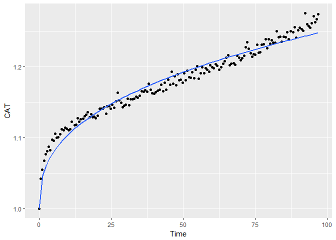

``` r
Rsquared_CAT <- cor(CAM$CAT, predict(m4))

#generate table or regression parameters#
reg4 <- tidy(m4)

h <- reg4$estimate
h <- h[c(1)]

g <- reg4$estimate
g <- g[c(2)]

#Fit CAeq using the range from Diam vs Time regression and the model m4#
CATeq <- (Co)/(1+(h*(range^g)))

#Fit CAeq using the range from Diam vs Time regression and the model m3#
CAOeq <- (1+e*range^f)*(Co)

#Store the information for this rep in a data frame#
CM_S2_2C <- data.frame(range, b, e, f, g, h, Rsquared_Diam, Rsquared_CAO, Rsquared_CAT, CAOeq, CATeq)

CM_Data <- rbind.data.frame(CM_S1_1A=CM_S1_1A, CM_S1_1B=CM_S1_1B, CM_S1_1C=CM_S1_1C, CM_S1_2A=CM_S1_2A, CM_S1_2B=CM_S1_2B, CM_S1_2C=CM_S1_2C, CM_S2_1A=CM_S2_1A, CM_S2_1B=CM_S2_1B, CM_S2_1C=CM_S2_1C, CM_S2_2A=CM_S2_2A, CM_S2_2B=CM_S2_2B, CM_S2_2C=CM_S2_2C)

Mean_Eq_Contact_Angle_CM <- mean(CM_Data[["CAOeq"]])

write.csv(CM_Data,"C:/Users/dell user/Desktop/CM_Data.csv")
```
