Determination of Contact Angle from Multiple Regression of Diameter vs Time and Multiple Regression of Contact Angle vs Time
============================================================================================================================

Introduction
------------

This script is able to analyze contact angle over time data from a sessile droplet profile. The dynamic nature of the sessile droplet placed on a porous surface such as a rock prevents an equilibrium contact angle from being determined, due to initial spreading of the droplet and imbibition of the droplet into the porous medium throughout the life of the droplet.

Upon contact, the base of the droplet spreads due to attractive forces on the surface. Eventually the base of the droplet will cease spreading and will come to a relatively constant value. After the droplet has reached this maximum base size, all changes in contact angle are assumed to be due to imbibition of the droplet into the rock. Previous studies attempting to determine the equilibrium contact angle of sessile droplets on porous surfaces have analyzed this spreading nature of the droplet to determine the time at which the droplet has reached its maximum base, and thus surface energies are in balance with the internal energies of the droplet. The mean of the left and right contact angles at this time of maximum spreading should thus be used as a quasi-equilibrium contact angle for the surface.

Step 1- This script first imports the raw data from excel files which contain the mean contact angle and diameter of the droplet over time. This data is then transformed into a data frame and the initial contact angle and diameter are determined so that a ratio of the contact angle at a given time to the initial contact angle and diameter at a given time to the initial diameter may be made. Several regression models are going to be compared using these ratios, these ratios will be expressed as the variables CAT and CAO.

Step 2- An exponential model will be fit to the diameter over time data, this is a model often used in semivariograms where three times the a parameter represents the range of the data, which in this case represents the time at which the diameter has reached its maximum size. This variable now known as the range will be used in the subsequent regressions of Contact angle over time to determine the semi-equilibrium contact angle.

Step 3- The regression models of mean contact angle over time, CAO over time, and CAT over time will be computed, plotted, and a summary of the regression statistics will be outputted in reg2, reg3, and reg4. The semi-equilibrium mean contact angles will be backcalculated from the ratio transformation to the variables. A summary output of the Coefficient of Correlation for each regression and the corresponding semi-equilibrium mean contact angles is contained in the Output data frame.

``` r
#STEP 1
#set working directory to work on EXCEL files#
setwd(dir="C:/Users/dell user/Desktop/GEOL_590/590_Final/Project_Data")

#Pull the data from the desktop#
cadata <- readxl::read_excel("CM-S1-1A_FINAL.xlsx")
cadata <- data.frame(cadata)

#Select on the variables of CA, Time, and Diameter#
CAM <- data.frame(CA=c(cadata$Var.6), Time=c(cadata$Var.13), Diam=c(cadata$Var.11))

#Select only the values in the column which are numeric#
CAM <- CAM[!is.na(as.numeric(as.character(CAM$CA))), ]
```

    ## Warning in `[.data.frame`(CAM, !is.na(as.numeric(as.character(CAM$CA))), :
    ## NAs introduced by coercion

``` r
#STEP 2
#Transform the data back into numbers, extract CAo (Co)#
CA<-c(as.numeric(levels(CAM$CA))[CAM$CA])
```

    ## Warning: NAs introduced by coercion

``` r
Time<-c(as.numeric(levels(CAM$Time))[CAM$Time])
```

    ## Warning: NAs introduced by coercion

``` r
Diam<-c(as.numeric(levels(CAM$Diam))[CAM$Diam])
```

    ## Warning: NAs introduced by coercion

``` r
Co<-CA[c(1)]
Do<-Diam[c(1)]

Diam <- c(Diam/Do)
CAT <- c(Co/CA)
CAO <- c(CA/Co)

CAM <- data.frame(CA=c(CA), Time=c(Time), Diam=c(Diam), CAO=c(CAO), CAT=c(CAT))

#Plot raw data Diameter vs Time#
library(ggplot2)
Diamplot <- ggplot(CAM, aes(Time, Diam))+
  geom_point()

print(Diamplot)
```

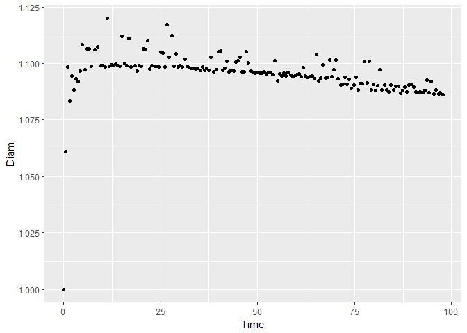

``` r
#regression for Diam vs Time#
m <- nls(Diam ~ 1+b*(1-exp(-Time/a)),start=list(a=1,b=1), data=CAM)
m
```

    ## Nonlinear regression model
    ##   model: Diam ~ 1 + b * (1 - exp(-Time/a))
    ##    data: CAM
    ##       a       b 
    ## 0.47455 0.09646 
    ##  residual sum-of-squares: 0.006533
    ## 
    ## Number of iterations to convergence: 4 
    ## Achieved convergence tolerance: 5.872e-06

``` r
#plot for Diam vs time#
Diamplot1<-ggplot(data=CAM, aes(x=Time,y=Diam))+
  geom_point()+
  geom_smooth(method="nls", 
              formula=y~1+b*(1-exp(-x/a)),
              method.args=list(start=c(a=1, b=1)),
              se=FALSE,
              data=CAM,
              color="red")

print(Diamplot1)
```

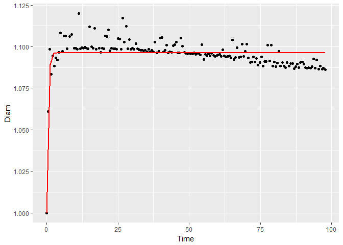

``` r
#Coefficient of Correlation for Diam vs Time model#
Rsquared_Diam <- cor(CAM$Diam, predict(m))

#generate table for regression parameters#
library(broom)
reg <- tidy(m)

#transform a parameter into range of regression#
a <- reg$estimate
a <- a[c(1)]
range <- 3*a

#make a variable for the b parameter for diameter vs time#
b <- reg$estimate
b <- b[c(2)]

#Step 3

#regression for CAO=(CA/Cao) vs Time#
m3 <- nls(CAO~1+e*(Time^f),start=list(e=1,f=1), data=CAM)
m3
```

    ## Nonlinear regression model
    ##   model: CAO ~ 1 + e * (Time^f)
    ##    data: CAM
    ##       e       f 
    ## -0.1369  0.1443 
    ##  residual sum-of-squares: 0.01506
    ## 
    ## Number of iterations to convergence: 9 
    ## Achieved convergence tolerance: 3.652e-06

``` r
#plot for m3#
CAOplot <- ggplot(data=CAM, aes(x=Time, y=CAO))+
  geom_point()+
  geom_smooth(method="nls",
              formula=y~1+(e*x^f),
              method.args=list(start=c(e=1, f=1)),
              se=FALSE)

print(CAOplot)
```

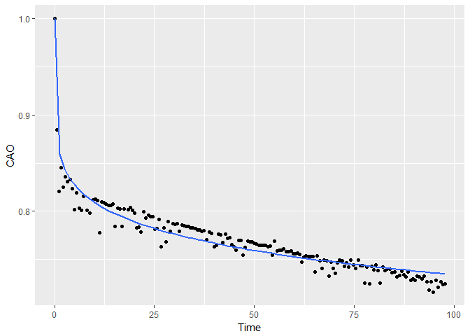

``` r
#Coefficient of correlation for CA/CAo vs Time (model=m3)#
Rsquared_CAO <- cor(CAM$CAO, predict(m3))

#generate table for regression parameters#
reg3<- tidy(m3)

e <- reg3$estimate
e <- e[c(1)]

f <- reg3$estimate
f <- f[c(2)]

#regression for CA using next method#
m4 <- nls(CAT~h*(Time^g)+1,start=list(h=1,g=1), data=CAM)
m4
```

    ## Nonlinear regression model
    ##   model: CAT ~ h * (Time^g) + 1
    ##    data: CAM
    ##      h      g 
    ## 0.1511 0.1902 
    ##  residual sum-of-squares: 0.04418
    ## 
    ## Number of iterations to convergence: 9 
    ## Achieved convergence tolerance: 3.241e-06

``` r
CATplot <- ggplot(data=CAM, aes(x=Time, y=CAT))+
  geom_point()+
  geom_smooth(method="nls",
              formula=y~1+(h*(x^g)),
              method.args=list(start=c(h=1, g=1)),
              se=FALSE)
print(CATplot)
```

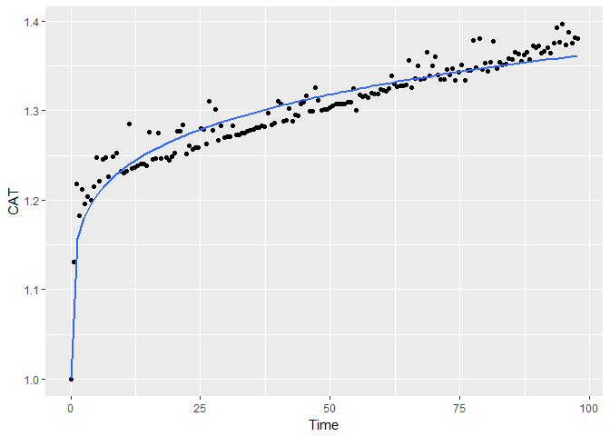

``` r
Rsquared_CAT <- cor(CAM$CAT, predict(m4))

#generate table or regression parameters#
reg4 <- tidy(m4)

h <- reg4$estimate
h <- h[c(1)]

g <- reg4$estimate
g <- g[c(2)]

#Fit CAeq using the range from Diam vs Time regression and the model m4#
CATeq <- (Co)/(1+(h*(range^g)))

#Fit CAeq using the range from Diam vs Time regression and the model m3#
CAOeq <- (1+e*range^f)*(Co)

#Store the information for this rep in a data frame#
CM_S1_1A <- data.frame(range, b, e, f, g, h, Rsquared_Diam, Rsquared_CAO, Rsquared_CAT, CAOeq, CATeq)

#Pull the data from the desktop#
cadata <- readxl::read_excel("CM-S1-1B_FINAL.xlsx")
cadata <- data.frame(cadata)

#Select on the variables of CA, Time, and Diameter#
CAM <- data.frame(CA=c(cadata$Var.6), Time=c(cadata$Var.13), Diam=c(cadata$Var.11))

#Select only the values in the column which are numeric#
CAM <- CAM[!is.na(as.numeric(as.character(CAM$CA))), ]
```

    ## Warning in `[.data.frame`(CAM, !is.na(as.numeric(as.character(CAM$CA))), :
    ## NAs introduced by coercion

``` r
#Transform the data back into numbers, extract CAo (Co)#
CA<-c(as.numeric(levels(CAM$CA))[CAM$CA])
```

    ## Warning: NAs introduced by coercion

``` r
Time<-c(as.numeric(levels(CAM$Time))[CAM$Time])
```

    ## Warning: NAs introduced by coercion

``` r
Diam<-c(as.numeric(levels(CAM$Diam))[CAM$Diam])
```

    ## Warning: NAs introduced by coercion

``` r
Co<-CA[c(1)]
Do<-Diam[c(1)]

Diam <- c(Diam/Do)
CAT <- c(Co/CA)
CAO <- c(CA/Co)

CAM <- data.frame(CA=c(CA), Time=c(Time), Diam=c(Diam), CAO=c(CAO), CAT=c(CAT))

#Plot raw data Diameter vs Time#
library(ggplot2)
Diamplot <- ggplot(CAM, aes(Time, Diam))+
  geom_point()

print(Diamplot)
```

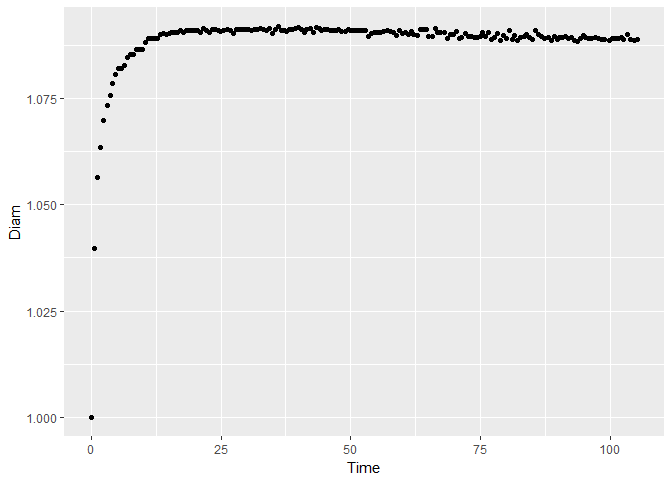

``` r
#regression for Diam vs Time#
m <- nls(Diam ~ 1+b*(1-exp(-Time/a)),start=list(a=1,b=1), data=CAM)
m
```

    ## Nonlinear regression model
    ##   model: Diam ~ 1 + b * (1 - exp(-Time/a))
    ##    data: CAM
    ##       a       b 
    ## 1.51702 0.08993 
    ##  residual sum-of-squares: 0.0006766
    ## 
    ## Number of iterations to convergence: 11 
    ## Achieved convergence tolerance: 3.491e-06

``` r
#plot for Diam vs time#
Diamplot1<-ggplot(data=CAM, aes(x=Time,y=Diam))+
  geom_point()+
  geom_smooth(method="nls", 
              formula=y~1+b*(1-exp(-x/a)),
              method.args=list(start=c(a=1, b=1)),
              se=FALSE,
              data=CAM,
              color="red")

print(Diamplot1)
```

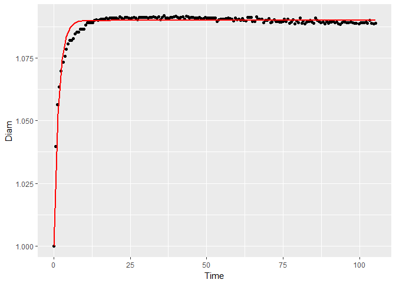

``` r
#Coefficient of Correlation for Diam vs Time model#
Rsquared_Diam <- cor(CAM$Diam, predict(m))

#generate table for regression parameters#
library(broom)
reg <- tidy(m)

#transform a parameter into range of regression#
a <- reg$estimate
a <- a[c(1)]
range <- 3*a

#make a variable for the b parameter for diameter vs time#
b <- reg$estimate
b <- b[c(2)]

#regression for CAO=(CA/Cao) vs Time#
m3 <- nls(CAO~1+e*(Time^f),start=list(e=1,f=1), data=CAM)
m3
```

    ## Nonlinear regression model
    ##   model: CAO ~ 1 + e * (Time^f)
    ##    data: CAM
    ##        e        f 
    ## -0.04516  0.26520 
    ##  residual sum-of-squares: 0.002676
    ## 
    ## Number of iterations to convergence: 9 
    ## Achieved convergence tolerance: 5.754e-07

``` r
#plot for m3#
CAOplot <- ggplot(data=CAM, aes(x=Time, y=CAO))+
  geom_point()+
  geom_smooth(method="nls",
              formula=y~1+(e*x^f),
              method.args=list(start=c(e=1, f=1)),
              se=FALSE)

print(CAOplot)
```

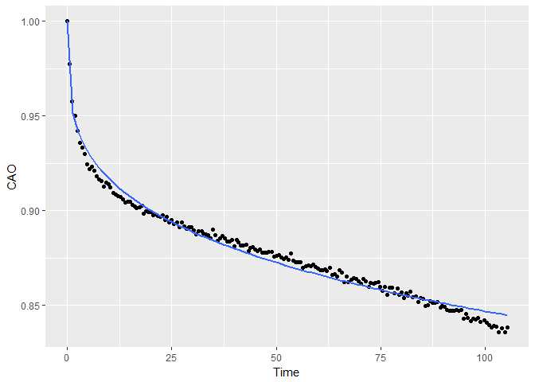

``` r
#Coefficient of correlation for CA/CAo vs Time (model=m3)#
Rsquared_CAO <- cor(CAM$CAO, predict(m3))

#generate table for regression parameters#
reg3<- tidy(m3)

e <- reg3$estimate
e <- e[c(1)]

f <- reg3$estimate
f <- f[c(2)]

#regression for CA using next method#
m4 <- nls(CAT~h*(Time^g)+1,start=list(h=1,g=1), data=CAM)
m4
```

    ## Nonlinear regression model
    ##   model: CAT ~ h * (Time^g) + 1
    ##    data: CAM
    ##       h       g 
    ## 0.04486 0.30244 
    ##  residual sum-of-squares: 0.004948
    ## 
    ## Number of iterations to convergence: 8 
    ## Achieved convergence tolerance: 8.031e-06

``` r
CATplot <- ggplot(data=CAM, aes(x=Time, y=CAT))+
  geom_point()+
  geom_smooth(method="nls",
              formula=y~1+(h*(x^g)),
              method.args=list(start=c(h=1, g=1)),
              se=FALSE)
print(CATplot)
```

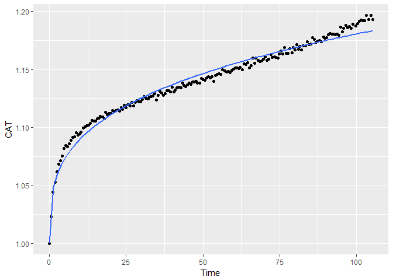

``` r
Rsquared_CAT <- cor(CAM$CAT, predict(m4))

#generate table or regression parameters#
reg4 <- tidy(m4)

h <- reg4$estimate
h <- h[c(1)]

g <- reg4$estimate
g <- g[c(2)]

#Fit CAeq using the range from Diam vs Time regression and the model m4#
CATeq <- (Co)/(1+(h*(range^g)))

#Fit CAeq using the range from Diam vs Time regression and the model m3#
CAOeq <- (1+e*range^f)*(Co)

#Store the information for this rep in a data frame#
CM_S1_1B <- data.frame(range, b, e, f, g, h, Rsquared_Diam, Rsquared_CAO, Rsquared_CAT, CAOeq, CATeq)

#Pull the data from the desktop#
cadata <- readxl::read_excel("CM-S1-1C_FINAL.xlsx")
cadata <- data.frame(cadata)

#Select on the variables of CA, Time, and Diameter#
CAM <- data.frame(CA=c(cadata$Var.6), Time=c(cadata$Var.13), Diam=c(cadata$Var.11))

#Select only the values in the column which are numeric#
CAM <- CAM[!is.na(as.numeric(as.character(CAM$CA))), ]
```

    ## Warning in `[.data.frame`(CAM, !is.na(as.numeric(as.character(CAM$CA))), :
    ## NAs introduced by coercion

``` r
#Transform the data back into numbers, extract CAo (Co)#
CA<-c(as.numeric(levels(CAM$CA))[CAM$CA])
```

    ## Warning: NAs introduced by coercion

``` r
Time<-c(as.numeric(levels(CAM$Time))[CAM$Time])
```

    ## Warning: NAs introduced by coercion

``` r
Diam<-c(as.numeric(levels(CAM$Diam))[CAM$Diam])
```

    ## Warning: NAs introduced by coercion

``` r
Co<-CA[c(1)]
Do<-Diam[c(1)]

Diam <- c(Diam/Do)
CAT <- c(Co/CA)
CAO <- c(CA/Co)

CAM <- data.frame(CA=c(CA), Time=c(Time), Diam=c(Diam), CAO=c(CAO), CAT=c(CAT))

#Plot raw data Diameter vs Time#
library(ggplot2)
Diamplot <- ggplot(CAM, aes(Time, Diam))+
  geom_point()

print(Diamplot)
```

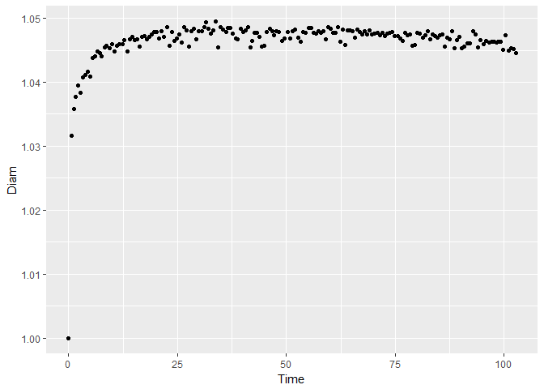

``` r
#regression for Diam vs Time#
m <- nls(Diam ~ 1+b*(1-exp(-Time/a)),start=list(a=1,b=1), data=CAM)
m
```

    ## Nonlinear regression model
    ##   model: Diam ~ 1 + b * (1 - exp(-Time/a))
    ##    data: CAM
    ##       a       b 
    ## 0.86847 0.04689 
    ##  residual sum-of-squares: 0.0004626
    ## 
    ## Number of iterations to convergence: 13 
    ## Achieved convergence tolerance: 7.461e-06

``` r
#plot for Diam vs time#
Diamplot1<-ggplot(data=CAM, aes(x=Time,y=Diam))+
  geom_point()+
  geom_smooth(method="nls", 
              formula=y~1+b*(1-exp(-x/a)),
              method.args=list(start=c(a=1, b=1)),
              se=FALSE,
              data=CAM,
              color="red")

print(Diamplot1)
```

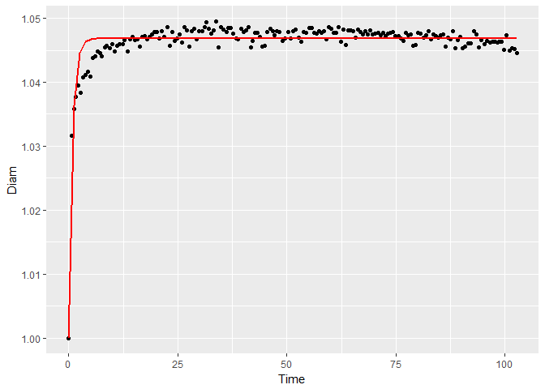

``` r
#Coefficient of Correlation for Diam vs Time model#
Rsquared_Diam <- cor(CAM$Diam, predict(m))

#generate table for regression parameters#
library(broom)
reg <- tidy(m)

#transform a parameter into range of regression#
a <- reg$estimate
a <- a[c(1)]
range <- 3*a

#make a variable for the b parameter for diameter vs time#
b <- reg$estimate
b <- b[c(2)]

#regression for CAO=(CA/Cao) vs Time#
m3 <- nls(CAO~1+e*(Time^f),start=list(e=1,f=1), data=CAM)
m3
```

    ## Nonlinear regression model
    ##   model: CAO ~ 1 + e * (Time^f)
    ##    data: CAM
    ##        e        f 
    ## -0.04918  0.23952 
    ##  residual sum-of-squares: 0.003243
    ## 
    ## Number of iterations to convergence: 9 
    ## Achieved convergence tolerance: 2.415e-06

``` r
#plot for m3#
CAOplot <- ggplot(data=CAM, aes(x=Time, y=CAO))+
  geom_point()+
  geom_smooth(method="nls",
              formula=y~1+(e*x^f),
              method.args=list(start=c(e=1, f=1)),
              se=FALSE)

print(CAOplot)
```

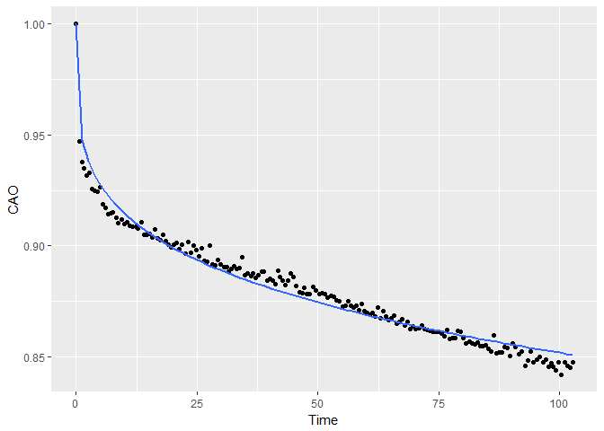

``` r
#Coefficient of correlation for CA/CAo vs Time (model=m3)#
Rsquared_CAO <- cor(CAM$CAO, predict(m3))

#generate table for regression parameters#
reg3<- tidy(m3)

e <- reg3$estimate
e <- e[c(1)]

f <- reg3$estimate
f <- f[c(2)]

#regression for CA using next method#
m4 <- nls(CAT~h*(Time^g)+1,start=list(h=1,g=1), data=CAM)
m4
```

    ## Nonlinear regression model
    ##   model: CAT ~ h * (Time^g) + 1
    ##    data: CAM
    ##       h       g 
    ## 0.04912 0.27470 
    ##  residual sum-of-squares: 0.005912
    ## 
    ## Number of iterations to convergence: 9 
    ## Achieved convergence tolerance: 3.954e-06

``` r
CATplot <- ggplot(data=CAM, aes(x=Time, y=CAT))+
  geom_point()+
  geom_smooth(method="nls",
              formula=y~1+(h*(x^g)),
              method.args=list(start=c(h=1, g=1)),
              se=FALSE)
print(CATplot)
```

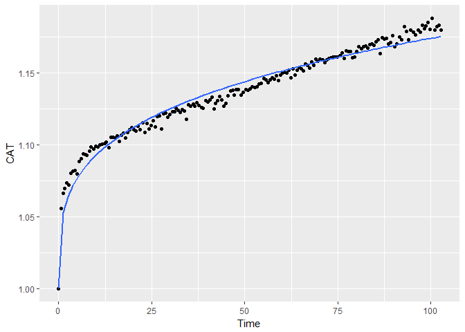

``` r
Rsquared_CAT <- cor(CAM$CAT, predict(m4))

#generate table or regression parameters#
reg4 <- tidy(m4)

h <- reg4$estimate
h <- h[c(1)]

g <- reg4$estimate
g <- g[c(2)]

#Fit CAeq using the range from Diam vs Time regression and the model m4#
CATeq <- (Co)/(1+(h*(range^g)))

#Fit CAeq using the range from Diam vs Time regression and the model m3#
CAOeq <- (1+e*range^f)*(Co)

#Store the information for this rep in a data frame#
CM_S1_1C <- data.frame(range, b, e, f, g, h, Rsquared_Diam, Rsquared_CAO, Rsquared_CAT, CAOeq, CATeq)

#Pull the data from the desktop#
cadata <- readxl::read_excel("CM-S1-2A_FINAL.xlsx")
cadata <- data.frame(cadata)

#Select on the variables of CA, Time, and Diameter#
CAM <- data.frame(CA=c(cadata$Var.6), Time=c(cadata$Var.13), Diam=c(cadata$Var.11))

#Select only the values in the column which are numeric#
CAM <- CAM[!is.na(as.numeric(as.character(CAM$CA))), ]
```

    ## Warning in `[.data.frame`(CAM, !is.na(as.numeric(as.character(CAM$CA))), :
    ## NAs introduced by coercion

``` r
#Transform the data back into numbers, extract CAo (Co)#
CA<-c(as.numeric(levels(CAM$CA))[CAM$CA])
```

    ## Warning: NAs introduced by coercion

``` r
Time<-c(as.numeric(levels(CAM$Time))[CAM$Time])
```

    ## Warning: NAs introduced by coercion

``` r
Diam<-c(as.numeric(levels(CAM$Diam))[CAM$Diam])
```

    ## Warning: NAs introduced by coercion

``` r
Co<-CA[c(1)]
Do<-Diam[c(1)]

Diam <- c(Diam/Do)
CAT <- c(Co/CA)
CAO <- c(CA/Co)

CAM <- data.frame(CA=c(CA), Time=c(Time), Diam=c(Diam), CAO=c(CAO), CAT=c(CAT))

#Plot raw data Diameter vs Time#
library(ggplot2)
Diamplot <- ggplot(CAM, aes(Time, Diam))+
  geom_point()

print(Diamplot)
```

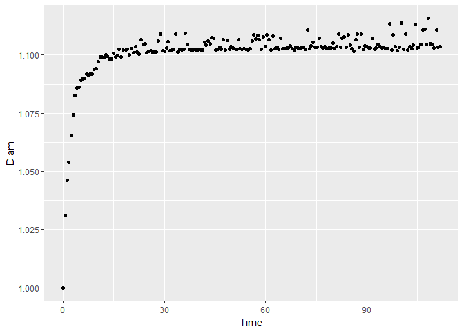

``` r
#regression for Diam vs Time#
m <- nls(Diam ~ 1+b*(1-exp(-Time/a)),start=list(a=1,b=1), data=CAM)
m
```

    ## Nonlinear regression model
    ##   model: Diam ~ 1 + b * (1 - exp(-Time/a))
    ##    data: CAM
    ##      a      b 
    ## 2.5242 0.1038 
    ##  residual sum-of-squares: 0.00215
    ## 
    ## Number of iterations to convergence: 10 
    ## Achieved convergence tolerance: 3.032e-06

``` r
#plot for Diam vs time#
Diamplot1<-ggplot(data=CAM, aes(x=Time,y=Diam))+
  geom_point()+
  geom_smooth(method="nls", 
              formula=y~1+b*(1-exp(-x/a)),
              method.args=list(start=c(a=1, b=1)),
              se=FALSE,
              data=CAM,
              color="red")

print(Diamplot1)
```

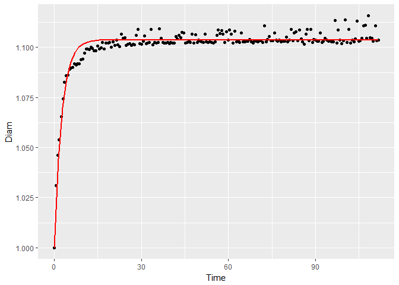

``` r
#Coefficient of Correlation for Diam vs Time model#
Rsquared_Diam <- cor(CAM$Diam, predict(m))

#generate table for regression parameters#
library(broom)
reg <- tidy(m)

#transform a parameter into range of regression#
a <- reg$estimate
a <- a[c(1)]
range <- 3*a

#make a variable for the b parameter for diameter vs time#
b <- reg$estimate
b <- b[c(2)]

#regression for CAO=(CA/Cao) vs Time#
m3 <- nls(CAO~1+e*(Time^f),start=list(e=1,f=1), data=CAM)
m3
```

    ## Nonlinear regression model
    ##   model: CAO ~ 1 + e * (Time^f)
    ##    data: CAM
    ##        e        f 
    ## -0.07105  0.22221 
    ##  residual sum-of-squares: 0.01127
    ## 
    ## Number of iterations to convergence: 9 
    ## Achieved convergence tolerance: 9.501e-07

``` r
#plot for m3#
CAOplot <- ggplot(data=CAM, aes(x=Time, y=CAO))+
  geom_point()+
  geom_smooth(method="nls",
              formula=y~1+(e*x^f),
              method.args=list(start=c(e=1, f=1)),
              se=FALSE)

print(CAOplot)
```

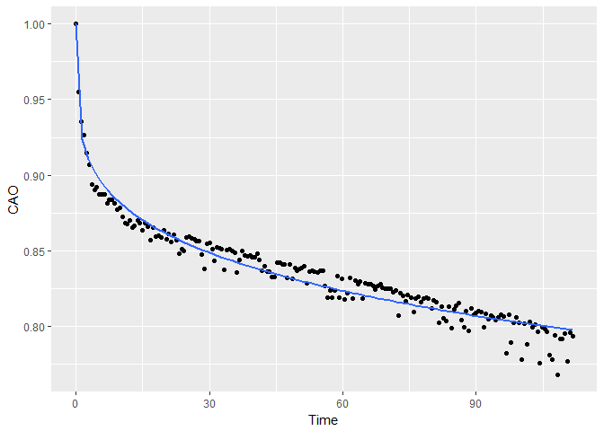

``` r
#Coefficient of correlation for CA/CAo vs Time (model=m3)#
Rsquared_CAO <- cor(CAM$CAO, predict(m3))

#generate table for regression parameters#
reg3<- tidy(m3)

e <- reg3$estimate
e <- e[c(1)]

f <- reg3$estimate
f <- f[c(2)]

#regression for CA using next method#
m4 <- nls(CAT~h*(Time^g)+1,start=list(h=1,g=1), data=CAM)
m4
```

    ## Nonlinear regression model
    ##   model: CAT ~ h * (Time^g) + 1
    ##    data: CAM
    ##       h       g 
    ## 0.07209 0.26684 
    ##  residual sum-of-squares: 0.02616
    ## 
    ## Number of iterations to convergence: 8 
    ## Achieved convergence tolerance: 1.163e-06

``` r
CATplot <- ggplot(data=CAM, aes(x=Time, y=CAT))+
  geom_point()+
  geom_smooth(method="nls",
              formula=y~1+(h*(x^g)),
              method.args=list(start=c(h=1, g=1)),
              se=FALSE)
print(CATplot)
```

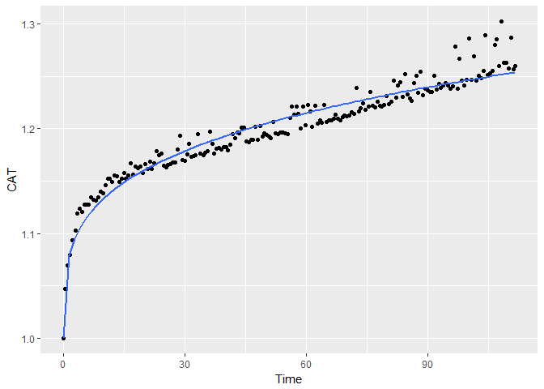

``` r
Rsquared_CAT <- cor(CAM$CAT, predict(m4))

#generate table or regression parameters#
reg4 <- tidy(m4)

h <- reg4$estimate
h <- h[c(1)]

g <- reg4$estimate
g <- g[c(2)]

#Fit CAeq using the range from Diam vs Time regression and the model m4#
CATeq <- (Co)/(1+(h*(range^g)))

#Fit CAeq using the range from Diam vs Time regression and the model m3#
CAOeq <- (1+e*range^f)*(Co)

#Store the information for this rep in a data frame#
CM_S1_2A <- data.frame(range, b, e, f, g, h, Rsquared_Diam, Rsquared_CAO, Rsquared_CAT, CAOeq, CATeq)

#Pull the data from the desktop#
cadata <- readxl::read_excel("CM-S1-2B_FINAL.xlsx")
cadata <- data.frame(cadata)

#Select on the variables of CA, Time, and Diameter#
CAM <- data.frame(CA=c(cadata$Var.6), Time=c(cadata$Var.13), Diam=c(cadata$Var.11))

#Select only the values in the column which are numeric#
CAM <- CAM[!is.na(as.numeric(as.character(CAM$CA))), ]
```

    ## Warning in `[.data.frame`(CAM, !is.na(as.numeric(as.character(CAM$CA))), :
    ## NAs introduced by coercion

``` r
#Transform the data back into numbers, extract CAo (Co)#
CA<-c(as.numeric(levels(CAM$CA))[CAM$CA])
```

    ## Warning: NAs introduced by coercion

``` r
Time<-c(as.numeric(levels(CAM$Time))[CAM$Time])
```

    ## Warning: NAs introduced by coercion

``` r
Diam<-c(as.numeric(levels(CAM$Diam))[CAM$Diam])
```

    ## Warning: NAs introduced by coercion

``` r
Co<-CA[c(1)]
Do<-Diam[c(1)]

Diam <- c(Diam/Do)
CAT <- c(Co/CA)
CAO <- c(CA/Co)

CAM <- data.frame(CA=c(CA), Time=c(Time), Diam=c(Diam), CAO=c(CAO), CAT=c(CAT))

#Plot raw data Diameter vs Time#
library(ggplot2)
Diamplot <- ggplot(CAM, aes(Time, Diam))+
  geom_point()

print(Diamplot)
```

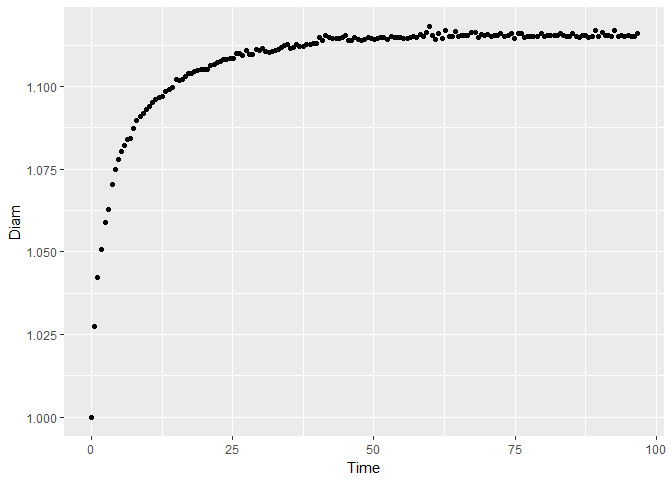

``` r
#regression for Diam vs Time#
m <- nls(Diam ~ 1+b*(1-exp(-Time/a)),start=list(a=1,b=1), data=CAM)
m
```

    ## Nonlinear regression model
    ##   model: Diam ~ 1 + b * (1 - exp(-Time/a))
    ##    data: CAM
    ##      a      b 
    ## 4.7260 0.1133 
    ##  residual sum-of-squares: 0.003012
    ## 
    ## Number of iterations to convergence: 12 
    ## Achieved convergence tolerance: 8.668e-06

``` r
#plot for Diam vs time#
Diamplot1<-ggplot(data=CAM, aes(x=Time,y=Diam))+
  geom_point()+
  geom_smooth(method="nls", 
              formula=y~1+b*(1-exp(-x/a)),
              method.args=list(start=c(a=1, b=1)),
              se=FALSE,
              data=CAM,
              color="red")

print(Diamplot1)
```

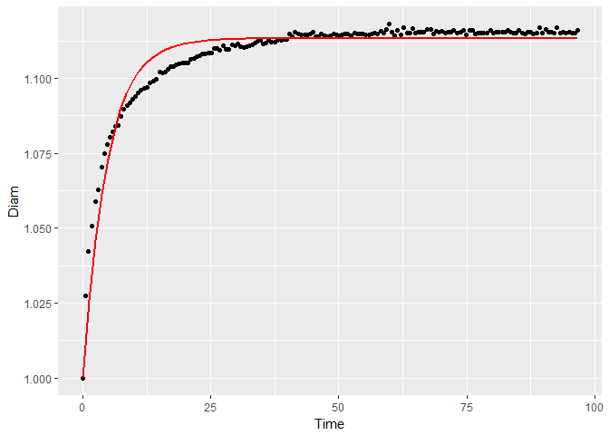

``` r
#Coefficient of Correlation for Diam vs Time model#
Rsquared_Diam <- cor(CAM$Diam, predict(m))

#generate table for regression parameters#
library(broom)
reg <- tidy(m)

#transform a parameter into range of regression#
a <- reg$estimate
a <- a[c(1)]
range <- 3*a

#make a variable for the b parameter for diameter vs time#
b <- reg$estimate
b <- b[c(2)]

#regression for CAO=(CA/Cao) vs Time#
m3 <- nls(CAO~1+e*(Time^f),start=list(e=1,f=1), data=CAM)
m3
```

    ## Nonlinear regression model
    ##   model: CAO ~ 1 + e * (Time^f)
    ##    data: CAM
    ##       e       f 
    ## -0.0709  0.2282 
    ##  residual sum-of-squares: 0.002379
    ## 
    ## Number of iterations to convergence: 9 
    ## Achieved convergence tolerance: 9.878e-06

``` r
#plot for m3#
CAOplot <- ggplot(data=CAM, aes(x=Time, y=CAO))+
  geom_point()+
  geom_smooth(method="nls",
              formula=y~1+(e*x^f),
              method.args=list(start=c(e=1, f=1)),
              se=FALSE)

print(CAOplot)
```

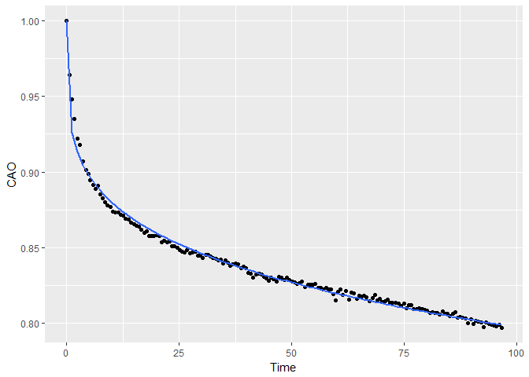

``` r
#Coefficient of correlation for CA/CAo vs Time (model=m3)#
Rsquared_CAO <- cor(CAM$CAO, predict(m3))

#generate table for regression parameters#
reg3<- tidy(m3)

e <- reg3$estimate
e <- e[c(1)]

f <- reg3$estimate
f <- f[c(2)]

#regression for CA using next method#
m4 <- nls(CAT~h*(Time^g)+1,start=list(h=1,g=1), data=CAM)
m4
```

    ## Nonlinear regression model
    ##   model: CAT ~ h * (Time^g) + 1
    ##    data: CAM
    ##       h       g 
    ## 0.07387 0.26691 
    ##  residual sum-of-squares: 0.00305
    ## 
    ## Number of iterations to convergence: 9 
    ## Achieved convergence tolerance: 2.377e-06

``` r
CATplot <- ggplot(data=CAM, aes(x=Time, y=CAT))+
  geom_point()+
  geom_smooth(method="nls",
              formula=y~1+(h*(x^g)),
              method.args=list(start=c(h=1, g=1)),
              se=FALSE)
print(CATplot)
```

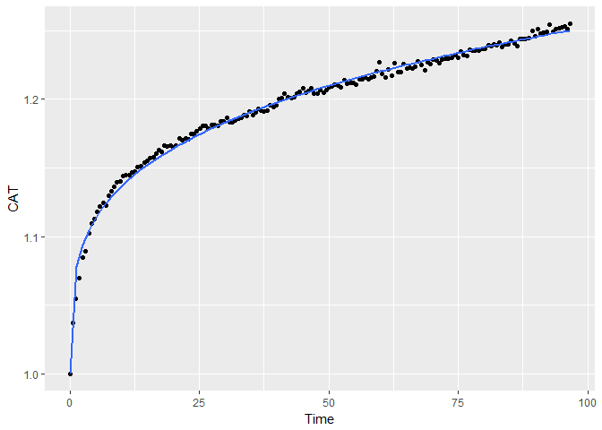

``` r
Rsquared_CAT <- cor(CAM$CAT, predict(m4))

#generate table or regression parameters#
reg4 <- tidy(m4)

h <- reg4$estimate
h <- h[c(1)]

g <- reg4$estimate
g <- g[c(2)]

#Fit CAeq using the range from Diam vs Time regression and the model m4#
CATeq <- (Co)/(1+(h*(range^g)))

#Fit CAeq using the range from Diam vs Time regression and the model m3#
CAOeq <- (1+e*range^f)*(Co)

#Store the information for this rep in a data frame#
CM_S1_2B <- data.frame(range, b, e, f, g, h, Rsquared_Diam, Rsquared_CAO, Rsquared_CAT, CAOeq, CATeq)

#Pull the data from the desktop#
cadata <- readxl::read_excel("CM-S1-2C_FINAL.xlsx")
cadata <- data.frame(cadata)

#Select on the variables of CA, Time, and Diameter#
CAM <- data.frame(CA=c(cadata$Var.6), Time=c(cadata$Var.13), Diam=c(cadata$Var.11))

#Select only the values in the column which are numeric#
CAM <- CAM[!is.na(as.numeric(as.character(CAM$CA))), ]
```

    ## Warning in `[.data.frame`(CAM, !is.na(as.numeric(as.character(CAM$CA))), :
    ## NAs introduced by coercion

``` r
#Transform the data back into numbers, extract CAo (Co)#
CA<-c(as.numeric(levels(CAM$CA))[CAM$CA])
```

    ## Warning: NAs introduced by coercion

``` r
Time<-c(as.numeric(levels(CAM$Time))[CAM$Time])
```

    ## Warning: NAs introduced by coercion

``` r
Diam<-c(as.numeric(levels(CAM$Diam))[CAM$Diam])
```

    ## Warning: NAs introduced by coercion

``` r
Co<-CA[c(1)]
Do<-Diam[c(1)]

Diam <- c(Diam/Do)
CAT <- c(Co/CA)
CAO <- c(CA/Co)

CAM <- data.frame(CA=c(CA), Time=c(Time), Diam=c(Diam), CAO=c(CAO), CAT=c(CAT))

#Plot raw data Diameter vs Time#
library(ggplot2)
Diamplot <- ggplot(CAM, aes(Time, Diam))+
  geom_point()

print(Diamplot)
```

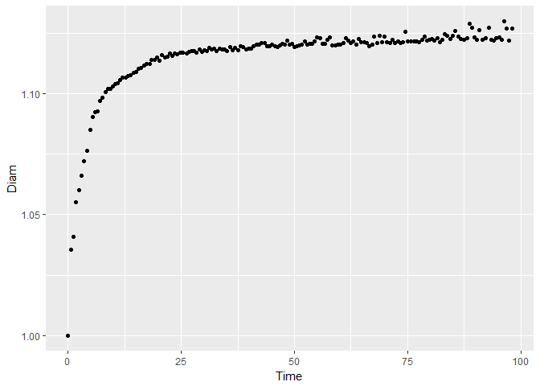

``` r
#regression for Diam vs Time#
m <- nls(Diam ~ 1+b*(1-exp(-Time/a)),start=list(a=1,b=1), data=CAM)
m
```

    ## Nonlinear regression model
    ##   model: Diam ~ 1 + b * (1 - exp(-Time/a))
    ##    data: CAM
    ##      a      b 
    ## 4.2703 0.1201 
    ##  residual sum-of-squares: 0.002749
    ## 
    ## Number of iterations to convergence: 11 
    ## Achieved convergence tolerance: 5.271e-06

``` r
#plot for Diam vs time#
Diamplot1<-ggplot(data=CAM, aes(x=Time,y=Diam))+
  geom_point()+
  geom_smooth(method="nls", 
              formula=y~1+b*(1-exp(-x/a)),
              method.args=list(start=c(a=1, b=1)),
              se=FALSE,
              data=CAM,
              color="red")

print(Diamplot1)
```

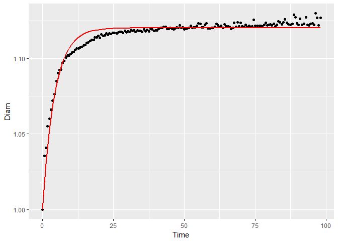

``` r
#Coefficient of Correlation for Diam vs Time model#
Rsquared_Diam <- cor(CAM$Diam, predict(m))

#generate table for regression parameters#
library(broom)
reg <- tidy(m)

#transform a parameter into range of regression#
a <- reg$estimate
a <- a[c(1)]
range <- 3*a

#make a variable for the b parameter for diameter vs time#
b <- reg$estimate
b <- b[c(2)]

#regression for CAO=(CA/Cao) vs Time#
m3 <- nls(CAO~1+e*(Time^f),start=list(e=1,f=1), data=CAM)
m3
```

    ## Nonlinear regression model
    ##   model: CAO ~ 1 + e * (Time^f)
    ##    data: CAM
    ##        e        f 
    ## -0.07548  0.21759 
    ##  residual sum-of-squares: 0.004453
    ## 
    ## Number of iterations to convergence: 9 
    ## Achieved convergence tolerance: 1.565e-06

``` r
#plot for m3#
CAOplot <- ggplot(data=CAM, aes(x=Time, y=CAO))+
  geom_point()+
  geom_smooth(method="nls",
              formula=y~1+(e*x^f),
              method.args=list(start=c(e=1, f=1)),
              se=FALSE)

print(CAOplot)
```

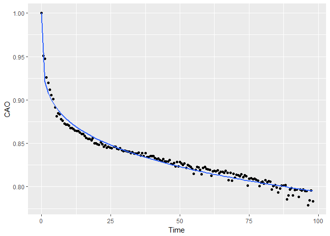

``` r
#Coefficient of correlation for CA/CAo vs Time (model=m3)#
Rsquared_CAO <- cor(CAM$CAO, predict(m3))

#generate table for regression parameters#
reg3<- tidy(m3)

e <- reg3$estimate
e <- e[c(1)]

f <- reg3$estimate
f <- f[c(2)]

#regression for CA using next method#
m4 <- nls(CAT~h*(Time^g)+1,start=list(h=1,g=1), data=CAM)
m4
```

    ## Nonlinear regression model
    ##   model: CAT ~ h * (Time^g) + 1
    ##    data: CAM
    ##       h       g 
    ## 0.07863 0.25753 
    ##  residual sum-of-squares: 0.008713
    ## 
    ## Number of iterations to convergence: 8 
    ## Achieved convergence tolerance: 4.604e-06

``` r
CATplot <- ggplot(data=CAM, aes(x=Time, y=CAT))+
  geom_point()+
  geom_smooth(method="nls",
              formula=y~1+(h*(x^g)),
              method.args=list(start=c(h=1, g=1)),
              se=FALSE)
print(CATplot)
```

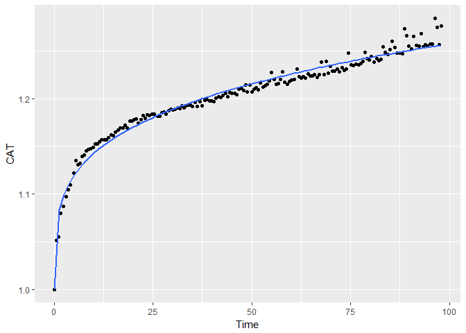

``` r
Rsquared_CAT <- cor(CAM$CAT, predict(m4))

#generate table or regression parameters#
reg4 <- tidy(m4)

h <- reg4$estimate
h <- h[c(1)]

g <- reg4$estimate
g <- g[c(2)]

#Fit CAeq using the range from Diam vs Time regression and the model m4#
CATeq <- (Co)/(1+(h*(range^g)))

#Fit CAeq using the range from Diam vs Time regression and the model m3#
CAOeq <- (1+e*range^f)*(Co)

#Store the information for this rep in a data frame#
CM_S1_2C <- data.frame(range, b, e, f, g, h, Rsquared_Diam, Rsquared_CAO, Rsquared_CAT, CAOeq, CATeq)

#Pull the data from the desktop#
cadata <- readxl::read_excel("CM-S2-1A_FINAL.xlsx")
cadata <- data.frame(cadata)

#Select on the variables of CA, Time, and Diameter#
CAM <- data.frame(CA=c(cadata$Var.6), Time=c(cadata$Var.13), Diam=c(cadata$Var.11))

#Select only the values in the column which are numeric#
CAM <- CAM[!is.na(as.numeric(as.character(CAM$CA))), ]
```

    ## Warning in `[.data.frame`(CAM, !is.na(as.numeric(as.character(CAM$CA))), :
    ## NAs introduced by coercion

``` r
#Transform the data back into numbers, extract CAo (Co)#
CA<-c(as.numeric(levels(CAM$CA))[CAM$CA])
```

    ## Warning: NAs introduced by coercion

``` r
Time<-c(as.numeric(levels(CAM$Time))[CAM$Time])
```

    ## Warning: NAs introduced by coercion

``` r
Diam<-c(as.numeric(levels(CAM$Diam))[CAM$Diam])
```

    ## Warning: NAs introduced by coercion

``` r
Co<-CA[c(1)]
Do<-Diam[c(1)]

Diam <- c(Diam/Do)
CAT <- c(Co/CA)
CAO <- c(CA/Co)

CAM <- data.frame(CA=c(CA), Time=c(Time), Diam=c(Diam), CAO=c(CAO), CAT=c(CAT))

#Plot raw data Diameter vs Time#
library(ggplot2)
Diamplot <- ggplot(CAM, aes(Time, Diam))+
  geom_point()

print(Diamplot)
```

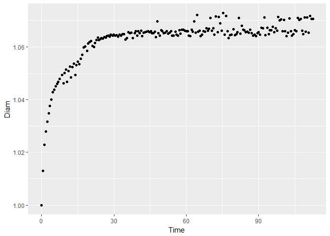

``` r
#regression for Diam vs Time#
m <- nls(Diam ~ 1+b*(1-exp(-Time/a)),start=list(a=1,b=1), data=CAM)
m
```

    ## Nonlinear regression model
    ##   model: Diam ~ 1 + b * (1 - exp(-Time/a))
    ##    data: CAM
    ##       a       b 
    ## 6.10027 0.06582 
    ##  residual sum-of-squares: 0.002178
    ## 
    ## Number of iterations to convergence: 13 
    ## Achieved convergence tolerance: 5.033e-06

``` r
#plot for Diam vs time#
Diamplot1<-ggplot(data=CAM, aes(x=Time,y=Diam))+
  geom_point()+
  geom_smooth(method="nls", 
              formula=y~1+b*(1-exp(-x/a)),
              method.args=list(start=c(a=1, b=1)),
              se=FALSE,
              data=CAM,
              color="red")

print(Diamplot1)
```

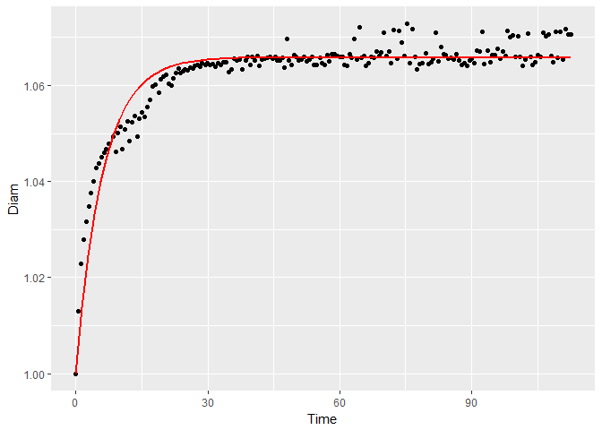

``` r
#Coefficient of Correlation for Diam vs Time model#
Rsquared_Diam <- cor(CAM$Diam, predict(m))

#generate table for regression parameters#
library(broom)
reg <- tidy(m)

#transform a parameter into range of regression#
a <- reg$estimate
a <- a[c(1)]
range <- 3*a

#make a variable for the b parameter for diameter vs time#
b <- reg$estimate
b <- b[c(2)]

#regression for CAO=(CA/Cao) vs Time#
m3 <- nls(CAO~1+e*(Time^f),start=list(e=1,f=1), data=CAM)
m3
```

    ## Nonlinear regression model
    ##   model: CAO ~ 1 + e * (Time^f)
    ##    data: CAM
    ##        e        f 
    ## -0.03097  0.37290 
    ##  residual sum-of-squares: 0.007984
    ## 
    ## Number of iterations to convergence: 9 
    ## Achieved convergence tolerance: 5.156e-07

``` r
#plot for m3#
CAOplot <- ggplot(data=CAM, aes(x=Time, y=CAO))+
  geom_point()+
  geom_smooth(method="nls",
              formula=y~1+(e*x^f),
              method.args=list(start=c(e=1, f=1)),
              se=FALSE)

print(CAOplot)
```

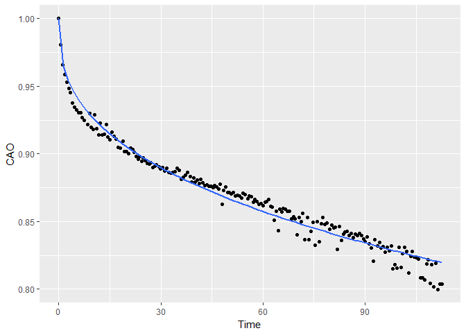

``` r
#Coefficient of correlation for CA/CAo vs Time (model=m3)#
Rsquared_CAO <- cor(CAM$CAO, predict(m3))

#generate table for regression parameters#
reg3<- tidy(m3)

e <- reg3$estimate
e <- e[c(1)]

f <- reg3$estimate
f <- f[c(2)]

#regression for CA using next method#
m4 <- nls(CAT~h*(Time^g)+1,start=list(h=1,g=1), data=CAM)
m4
```

    ## Nonlinear regression model
    ##   model: CAT ~ h * (Time^g) + 1
    ##    data: CAM
    ##       h       g 
    ## 0.02814 0.43496 
    ##  residual sum-of-squares: 0.01724
    ## 
    ## Number of iterations to convergence: 9 
    ## Achieved convergence tolerance: 8.675e-07

``` r
CATplot <- ggplot(data=CAM, aes(x=Time, y=CAT))+
  geom_point()+
  geom_smooth(method="nls",
              formula=y~1+(h*(x^g)),
              method.args=list(start=c(h=1, g=1)),
              se=FALSE)
print(CATplot)
```

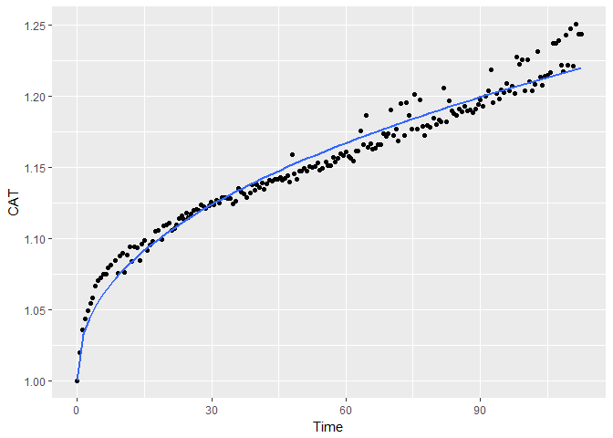

``` r
Rsquared_CAT <- cor(CAM$CAT, predict(m4))

#generate table or regression parameters#
reg4 <- tidy(m4)

h <- reg4$estimate
h <- h[c(1)]

g <- reg4$estimate
g <- g[c(2)]

#Fit CAeq using the range from Diam vs Time regression and the model m4#
CATeq <- (Co)/(1+(h*(range^g)))

#Fit CAeq using the range from Diam vs Time regression and the model m3#
CAOeq <- (1+e*range^f)*(Co)

#Store the information for this rep in a data frame#
CM_S2_1A <- data.frame(range, b, e, f, g, h, Rsquared_Diam, Rsquared_CAO, Rsquared_CAT, CAOeq, CATeq)

#Pull the data from the desktop#
cadata <- readxl::read_excel("CM-S2-1B_FINAL.xlsx")
cadata <- data.frame(cadata)

#Select on the variables of CA, Time, and Diameter#
CAM <- data.frame(CA=c(cadata$Var.6), Time=c(cadata$Var.13), Diam=c(cadata$Var.11))

#Select only the values in the column which are numeric#
CAM <- CAM[!is.na(as.numeric(as.character(CAM$CA))), ]
```

    ## Warning in `[.data.frame`(CAM, !is.na(as.numeric(as.character(CAM$CA))), :
    ## NAs introduced by coercion

``` r
#Transform the data back into numbers, extract CAo (Co)#
CA<-c(as.numeric(levels(CAM$CA))[CAM$CA])
```

    ## Warning: NAs introduced by coercion

``` r
Time<-c(as.numeric(levels(CAM$Time))[CAM$Time])
```

    ## Warning: NAs introduced by coercion

``` r
Diam<-c(as.numeric(levels(CAM$Diam))[CAM$Diam])
```

    ## Warning: NAs introduced by coercion

``` r
Co<-CA[c(1)]
Do<-Diam[c(1)]

Diam <- c(Diam/Do)
CAT <- c(Co/CA)
CAO <- c(CA/Co)

CAM <- data.frame(CA=c(CA), Time=c(Time), Diam=c(Diam), CAO=c(CAO), CAT=c(CAT))

#Plot raw data Diameter vs Time#
library(ggplot2)
Diamplot <- ggplot(CAM, aes(Time, Diam))+
  geom_point()

print(Diamplot)
```

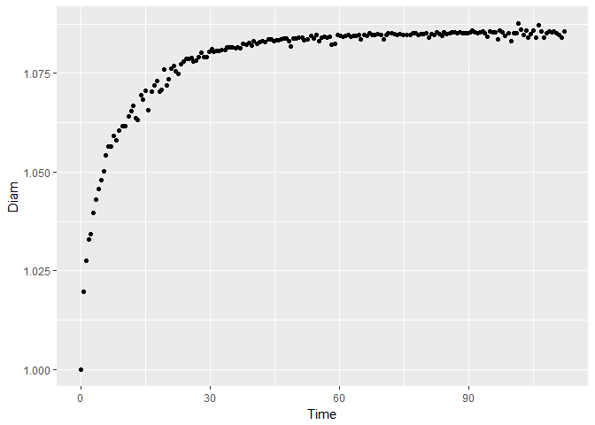

``` r
#regression for Diam vs Time#
m <- nls(Diam ~ 1+b*(1-exp(-Time/a)),start=list(a=1,b=1), data=CAM)
m
```

    ## Nonlinear regression model
    ##   model: Diam ~ 1 + b * (1 - exp(-Time/a))
    ##    data: CAM
    ##       a       b 
    ## 6.88430 0.08359 
    ##  residual sum-of-squares: 0.002074
    ## 
    ## Number of iterations to convergence: 12 
    ## Achieved convergence tolerance: 9.832e-06

``` r
#plot for Diam vs time#
Diamplot1<-ggplot(data=CAM, aes(x=Time,y=Diam))+
  geom_point()+
  geom_smooth(method="nls", 
              formula=y~1+b*(1-exp(-x/a)),
              method.args=list(start=c(a=1, b=1)),
              se=FALSE,
              data=CAM,
              color="red")

print(Diamplot1)
```

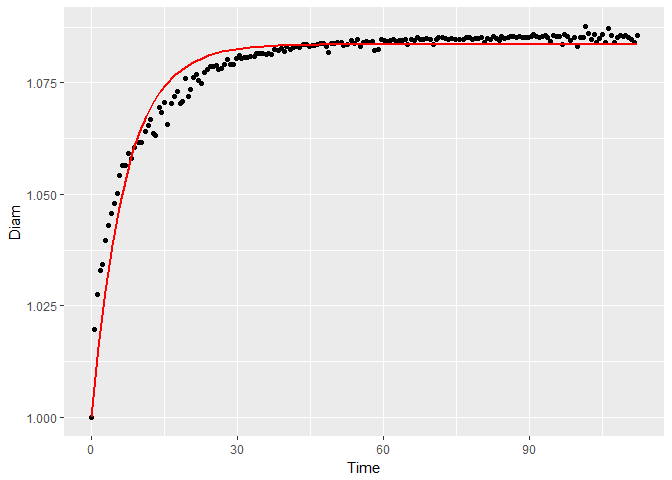

``` r
#Coefficient of Correlation for Diam vs Time model#
Rsquared_Diam <- cor(CAM$Diam, predict(m))

#generate table for regression parameters#
library(broom)
reg <- tidy(m)

#transform a parameter into range of regression#
a <- reg$estimate
a <- a[c(1)]
range <- 3*a

#make a variable for the b parameter for diameter vs time#
b <- reg$estimate
b <- b[c(2)]

#regression for CAO=(CA/Cao) vs Time#
m3 <- nls(CAO~1+e*(Time^f),start=list(e=1,f=1), data=CAM)
m3
```

    ## Nonlinear regression model
    ##   model: CAO ~ 1 + e * (Time^f)
    ##    data: CAM
    ##       e       f 
    ## -0.0449  0.2763 
    ##  residual sum-of-squares: 0.001902
    ## 
    ## Number of iterations to convergence: 9 
    ## Achieved convergence tolerance: 7.382e-06

``` r
#plot for m3#
CAOplot <- ggplot(data=CAM, aes(x=Time, y=CAO))+
  geom_point()+
  geom_smooth(method="nls",
              formula=y~1+(e*x^f),
              method.args=list(start=c(e=1, f=1)),
              se=FALSE)

print(CAOplot)
```

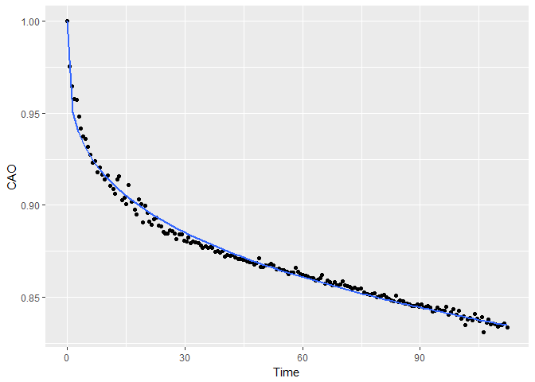

``` r
#Coefficient of correlation for CA/CAo vs Time (model=m3)#
Rsquared_CAO <- cor(CAM$CAO, predict(m3))

#generate table for regression parameters#
reg3<- tidy(m3)

e <- reg3$estimate
e <- e[c(1)]

f <- reg3$estimate
f <- f[c(2)]

#regression for CA using next method#
m4 <- nls(CAT~h*(Time^g)+1,start=list(h=1,g=1), data=CAM)
m4
```

    ## Nonlinear regression model
    ##   model: CAT ~ h * (Time^g) + 1
    ##    data: CAM
    ##       h       g 
    ## 0.04518 0.31201 
    ##  residual sum-of-squares: 0.002437
    ## 
    ## Number of iterations to convergence: 9 
    ## Achieved convergence tolerance: 1.956e-06

``` r
CATplot <- ggplot(data=CAM, aes(x=Time, y=CAT))+
  geom_point()+
  geom_smooth(method="nls",
              formula=y~1+(h*(x^g)),
              method.args=list(start=c(h=1, g=1)),
              se=FALSE)
print(CATplot)
```

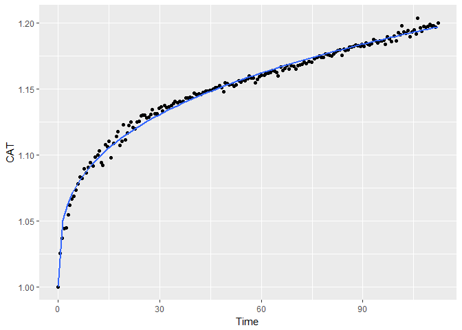

``` r
Rsquared_CAT <- cor(CAM$CAT, predict(m4))

#generate table or regression parameters#
reg4 <- tidy(m4)

h <- reg4$estimate
h <- h[c(1)]

g <- reg4$estimate
g <- g[c(2)]

#Fit CAeq using the range from Diam vs Time regression and the model m4#
CATeq <- (Co)/(1+(h*(range^g)))

#Fit CAeq using the range from Diam vs Time regression and the model m3#
CAOeq <- (1+e*range^f)*(Co)

#Store the information for this rep in a data frame#
CM_S2_1B <- data.frame(range, b, e, f, g, h, Rsquared_Diam, Rsquared_CAO, Rsquared_CAT, CAOeq, CATeq)

#Pull the data from the desktop#
cadata <- readxl::read_excel("CM-S2-1C_FINAL.xlsx")
cadata <- data.frame(cadata)

#Select on the variables of CA, Time, and Diameter#
CAM <- data.frame(CA=c(cadata$Var.6), Time=c(cadata$Var.13), Diam=c(cadata$Var.11))

#Select only the values in the column which are numeric#
CAM <- CAM[!is.na(as.numeric(as.character(CAM$CA))), ]
```

    ## Warning in `[.data.frame`(CAM, !is.na(as.numeric(as.character(CAM$CA))), :
    ## NAs introduced by coercion

``` r
#Transform the data back into numbers, extract CAo (Co)#
CA<-c(as.numeric(levels(CAM$CA))[CAM$CA])
```

    ## Warning: NAs introduced by coercion

``` r
Time<-c(as.numeric(levels(CAM$Time))[CAM$Time])
```

    ## Warning: NAs introduced by coercion

``` r
Diam<-c(as.numeric(levels(CAM$Diam))[CAM$Diam])
```

    ## Warning: NAs introduced by coercion

``` r
Co<-CA[c(1)]
Do<-Diam[c(1)]

Diam <- c(Diam/Do)
CAT <- c(Co/CA)
CAO <- c(CA/Co)

CAM <- data.frame(CA=c(CA), Time=c(Time), Diam=c(Diam), CAO=c(CAO), CAT=c(CAT))

#Plot raw data Diameter vs Time#
library(ggplot2)
Diamplot <- ggplot(CAM, aes(Time, Diam))+
  geom_point()

print(Diamplot)
```

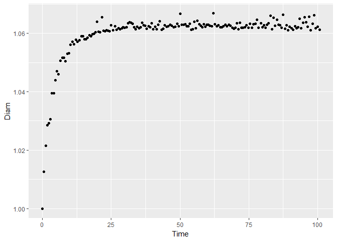

``` r
#regression for Diam vs Time#
m <- nls(Diam ~ 1+b*(1-exp(-Time/a)),start=list(a=1,b=1), data=CAM)
m
```

    ## Nonlinear regression model
    ##   model: Diam ~ 1 + b * (1 - exp(-Time/a))
    ##    data: CAM
    ##      a      b 
    ## 4.0819 0.0624 
    ##  residual sum-of-squares: 0.0004606
    ## 
    ## Number of iterations to convergence: 9 
    ## Achieved convergence tolerance: 5.886e-06

``` r
#plot for Diam vs time#
Diamplot1<-ggplot(data=CAM, aes(x=Time,y=Diam))+
  geom_point()+
  geom_smooth(method="nls", 
              formula=y~1+b*(1-exp(-x/a)),
              method.args=list(start=c(a=1, b=1)),
              se=FALSE,
              data=CAM,
              color="red")

print(Diamplot1)
```

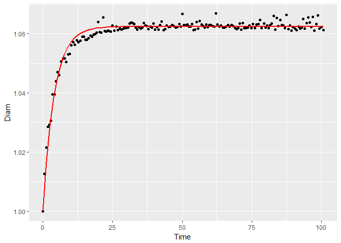

``` r
#Coefficient of Correlation for Diam vs Time model#
Rsquared_Diam <- cor(CAM$Diam, predict(m))

#generate table for regression parameters#
library(broom)
reg <- tidy(m)

#transform a parameter into range of regression#
a <- reg$estimate
a <- a[c(1)]
range <- 3*a

#make a variable for the b parameter for diameter vs time#
b <- reg$estimate
b <- b[c(2)]

#regression for CAO=(CA/Cao) vs Time#
m3 <- nls(CAO~1+e*(Time^f),start=list(e=1,f=1), data=CAM)
m3
```

    ## Nonlinear regression model
    ##   model: CAO ~ 1 + e * (Time^f)
    ##    data: CAM
    ##        e        f 
    ## -0.02953  0.33824 
    ##  residual sum-of-squares: 0.003668
    ## 
    ## Number of iterations to convergence: 8 
    ## Achieved convergence tolerance: 1.886e-06

``` r
#plot for m3#
CAOplot <- ggplot(data=CAM, aes(x=Time, y=CAO))+
  geom_point()+
  geom_smooth(method="nls",
              formula=y~1+(e*x^f),
              method.args=list(start=c(e=1, f=1)),
              se=FALSE)

print(CAOplot)
```

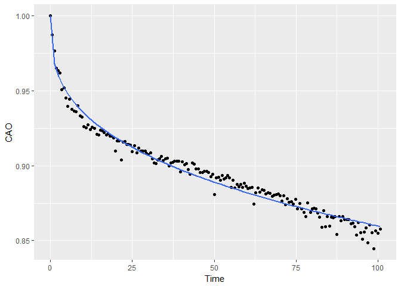

``` r
#Coefficient of correlation for CA/CAo vs Time (model=m3)#
Rsquared_CAO <- cor(CAM$CAO, predict(m3))

#generate table for regression parameters#
reg3<- tidy(m3)

e <- reg3$estimate
e <- e[c(1)]

f <- reg3$estimate
f <- f[c(2)]

#regression for CA using next method#
m4 <- nls(CAT~h*(Time^g)+1,start=list(h=1,g=1), data=CAM)
m4
```

    ## Nonlinear regression model
    ##   model: CAT ~ h * (Time^g) + 1
    ##    data: CAM
    ##       h       g 
    ## 0.02843 0.37880 
    ##  residual sum-of-squares: 0.006243
    ## 
    ## Number of iterations to convergence: 8 
    ## Achieved convergence tolerance: 7.148e-06

``` r
CATplot <- ggplot(data=CAM, aes(x=Time, y=CAT))+
  geom_point()+
  geom_smooth(method="nls",
              formula=y~1+(h*(x^g)),
              method.args=list(start=c(h=1, g=1)),
              se=FALSE)
print(CATplot)
```

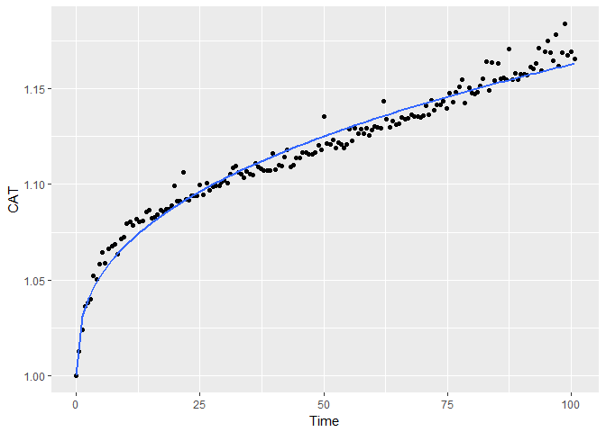

``` r
Rsquared_CAT <- cor(CAM$CAT, predict(m4))

#generate table or regression parameters#
reg4 <- tidy(m4)

h <- reg4$estimate
h <- h[c(1)]

g <- reg4$estimate
g <- g[c(2)]

#Fit CAeq using the range from Diam vs Time regression and the model m4#
CATeq <- (Co)/(1+(h*(range^g)))

#Fit CAeq using the range from Diam vs Time regression and the model m3#
CAOeq <- (1+e*range^f)*(Co)

#Store the information for this rep in a data frame#
CM_S2_1C <- data.frame(range, b, e, f, g, h, Rsquared_Diam, Rsquared_CAO, Rsquared_CAT, CAOeq, CATeq)

#Pull the data from the desktop#
cadata <- readxl::read_excel("CM-S2-2A_FINAL.xlsx")
cadata <- data.frame(cadata)

#Select on the variables of CA, Time, and Diameter#
CAM <- data.frame(CA=c(cadata$Var.6), Time=c(cadata$Var.13), Diam=c(cadata$Var.11))

#Select only the values in the column which are numeric#
CAM <- CAM[!is.na(as.numeric(as.character(CAM$CA))), ]
```

    ## Warning in `[.data.frame`(CAM, !is.na(as.numeric(as.character(CAM$CA))), :
    ## NAs introduced by coercion

``` r
#Transform the data back into numbers, extract CAo (Co)#
CA<-c(as.numeric(levels(CAM$CA))[CAM$CA])
```

    ## Warning: NAs introduced by coercion

``` r
Time<-c(as.numeric(levels(CAM$Time))[CAM$Time])
```

    ## Warning: NAs introduced by coercion

``` r
Diam<-c(as.numeric(levels(CAM$Diam))[CAM$Diam])
```

    ## Warning: NAs introduced by coercion

``` r
Co<-CA[c(1)]
Do<-Diam[c(1)]

Diam <- c(Diam/Do)
CAT <- c(Co/CA)
CAO <- c(CA/Co)

CAM <- data.frame(CA=c(CA), Time=c(Time), Diam=c(Diam), CAO=c(CAO), CAT=c(CAT))

#Plot raw data Diameter vs Time#
library(ggplot2)
Diamplot <- ggplot(CAM, aes(Time, Diam))+
  geom_point()

print(Diamplot)
```

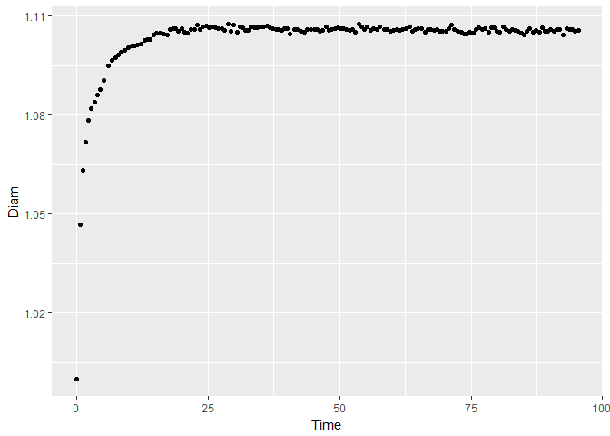

``` r
#regression for Diam vs Time#
m <- nls(Diam ~ 1+b*(1-exp(-Time/a)),start=list(a=1,b=1), data=CAM)
m
```

    ## Nonlinear regression model
    ##   model: Diam ~ 1 + b * (1 - exp(-Time/a))
    ##    data: CAM
    ##      a      b 
    ## 1.6689 0.1052 
    ##  residual sum-of-squares: 0.001279
    ## 
    ## Number of iterations to convergence: 12 
    ## Achieved convergence tolerance: 3.986e-06

``` r
#plot for Diam vs time#
Diamplot1<-ggplot(data=CAM, aes(x=Time,y=Diam))+
  geom_point()+
  geom_smooth(method="nls", 
              formula=y~1+b*(1-exp(-x/a)),
              method.args=list(start=c(a=1, b=1)),
              se=FALSE,
              data=CAM,
              color="red")

print(Diamplot1)
```

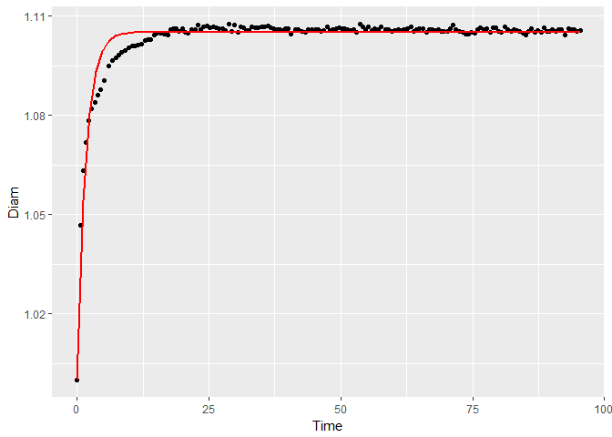

``` r
#Coefficient of Correlation for Diam vs Time model#
Rsquared_Diam <- cor(CAM$Diam, predict(m))

#generate table for regression parameters#
library(broom)
reg <- tidy(m)

#transform a parameter into range of regression#
a <- reg$estimate
a <- a[c(1)]
range <- 3*a

#make a variable for the b parameter for diameter vs time#
b <- reg$estimate
b <- b[c(2)]

#regression for CAO=(CA/Cao) vs Time#
m3 <- nls(CAO~1+e*(Time^f),start=list(e=1,f=1), data=CAM)
m3
```

    ## Nonlinear regression model
    ##   model: CAO ~ 1 + e * (Time^f)
    ##    data: CAM
    ##        e        f 
    ## -0.07888  0.21633 
    ##  residual sum-of-squares: 0.003322
    ## 
    ## Number of iterations to convergence: 9 
    ## Achieved convergence tolerance: 1.236e-06

``` r
#plot for m3#
CAOplot <- ggplot(data=CAM, aes(x=Time, y=CAO))+
  geom_point()+
  geom_smooth(method="nls",
              formula=y~1+(e*x^f),
              method.args=list(start=c(e=1, f=1)),
              se=FALSE)

print(CAOplot)
```

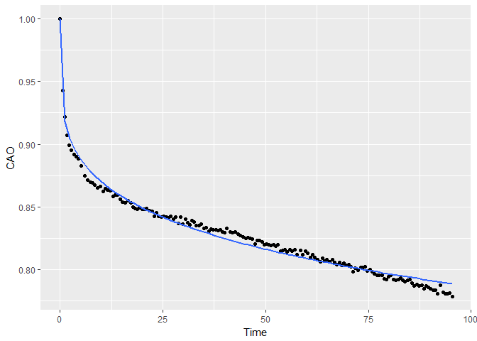

``` r
#Coefficient of correlation for CA/CAo vs Time (model=m3)#
Rsquared_CAO <- cor(CAM$CAO, predict(m3))

#generate table for regression parameters#
reg3<- tidy(m3)

e <- reg3$estimate
e <- e[c(1)]

f <- reg3$estimate
f <- f[c(2)]

#regression for CA using next method#
m4 <- nls(CAT~h*(Time^g)+1,start=list(h=1,g=1), data=CAM)
m4
```

    ## Nonlinear regression model
    ##   model: CAT ~ h * (Time^g) + 1
    ##    data: CAM
    ##       h       g 
    ## 0.08102 0.26215 
    ##  residual sum-of-squares: 0.008316
    ## 
    ## Number of iterations to convergence: 9 
    ## Achieved convergence tolerance: 5.719e-07

``` r
CATplot <- ggplot(data=CAM, aes(x=Time, y=CAT))+
  geom_point()+
  geom_smooth(method="nls",
              formula=y~1+(h*(x^g)),
              method.args=list(start=c(h=1, g=1)),
              se=FALSE)
print(CATplot)
```

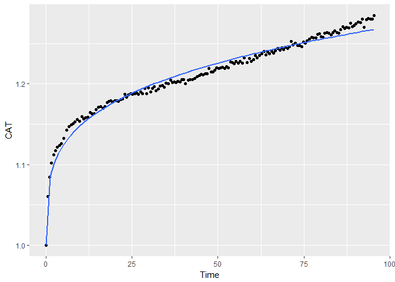

``` r
Rsquared_CAT <- cor(CAM$CAT, predict(m4))

#generate table or regression parameters#
reg4 <- tidy(m4)

h <- reg4$estimate
h <- h[c(1)]

g <- reg4$estimate
g <- g[c(2)]

#Fit CAeq using the range from Diam vs Time regression and the model m4#
CATeq <- (Co)/(1+(h*(range^g)))

#Fit CAeq using the range from Diam vs Time regression and the model m3#
CAOeq <- (1+e*range^f)*(Co)

#Store the information for this rep in a data frame#
CM_S2_2A <- data.frame(range, b, e, f, g, h, Rsquared_Diam, Rsquared_CAO, Rsquared_CAT, CAOeq, CATeq)

#Pull the data from the desktop#
cadata <- readxl::read_excel("CM-S2-2B_FINAL.xlsx")
cadata <- data.frame(cadata)

#Select on the variables of CA, Time, and Diameter#
CAM <- data.frame(CA=c(cadata$Var.6), Time=c(cadata$Var.13), Diam=c(cadata$Var.11))

#Select only the values in the column which are numeric#
CAM <- CAM[!is.na(as.numeric(as.character(CAM$CA))), ]
```

    ## Warning in `[.data.frame`(CAM, !is.na(as.numeric(as.character(CAM$CA))), :
    ## NAs introduced by coercion

``` r
#Transform the data back into numbers, extract CAo (Co)#
CA<-c(as.numeric(levels(CAM$CA))[CAM$CA])
```

    ## Warning: NAs introduced by coercion

``` r
Time<-c(as.numeric(levels(CAM$Time))[CAM$Time])
```

    ## Warning: NAs introduced by coercion

``` r
Diam<-c(as.numeric(levels(CAM$Diam))[CAM$Diam])
```

    ## Warning: NAs introduced by coercion

``` r
Co<-CA[c(1)]
Do<-Diam[c(1)]

Diam <- c(Diam/Do)
CAT <- c(Co/CA)
CAO <- c(CA/Co)

CAM <- data.frame(CA=c(CA), Time=c(Time), Diam=c(Diam), CAO=c(CAO), CAT=c(CAT))

#Plot raw data Diameter vs Time#
library(ggplot2)
Diamplot <- ggplot(CAM, aes(Time, Diam))+
  geom_point()

print(Diamplot)
```

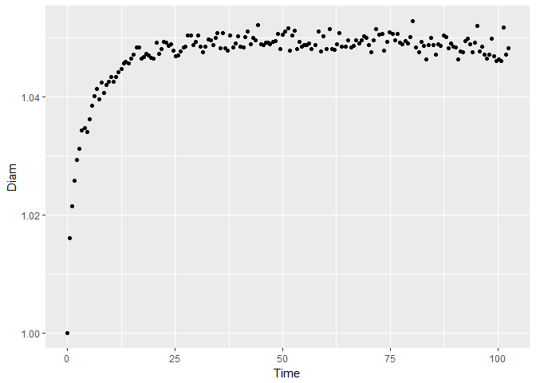

``` r
#regression for Diam vs Time#
m <- nls(Diam ~ 1+b*(1-exp(-Time/a)),start=list(a=1,b=1), data=CAM)
m
```

    ## Nonlinear regression model
    ##   model: Diam ~ 1 + b * (1 - exp(-Time/a))
    ##    data: CAM
    ##       a       b 
    ## 3.23785 0.04873 
    ##  residual sum-of-squares: 0.0006574
    ## 
    ## Number of iterations to convergence: 12 
    ## Achieved convergence tolerance: 5.016e-06

``` r
#plot for Diam vs time#
Diamplot1<-ggplot(data=CAM, aes(x=Time,y=Diam))+
  geom_point()+
  geom_smooth(method="nls", 
              formula=y~1+b*(1-exp(-x/a)),
              method.args=list(start=c(a=1, b=1)),
              se=FALSE,
              data=CAM,
              color="red")

print(Diamplot1)
```

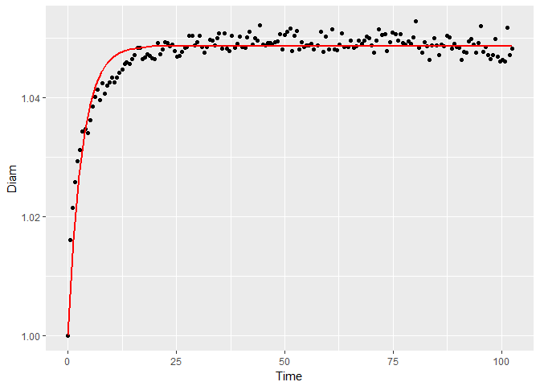

``` r
#Coefficient of Correlation for Diam vs Time model#
Rsquared_Diam <- cor(CAM$Diam, predict(m))

#generate table for regression parameters#
library(broom)
reg <- tidy(m)

#transform a parameter into range of regression#
a <- reg$estimate
a <- a[c(1)]
range <- 3*a

#make a variable for the b parameter for diameter vs time#
b <- reg$estimate
b <- b[c(2)]

#regression for CAO=(CA/Cao) vs Time#
m3 <- nls(CAO~1+e*(Time^f),start=list(e=1,f=1), data=CAM)
m3
```

    ## Nonlinear regression model
    ##   model: CAO ~ 1 + e * (Time^f)
    ##    data: CAM
    ##        e        f 
    ## -0.02993  0.33639 
    ##  residual sum-of-squares: 0.002528
    ## 
    ## Number of iterations to convergence: 8 
    ## Achieved convergence tolerance: 7.146e-06

``` r
#plot for m3#
CAOplot <- ggplot(data=CAM, aes(x=Time, y=CAO))+
  geom_point()+
  geom_smooth(method="nls",
              formula=y~1+(e*x^f),
              method.args=list(start=c(e=1, f=1)),
              se=FALSE)

print(CAOplot)
```

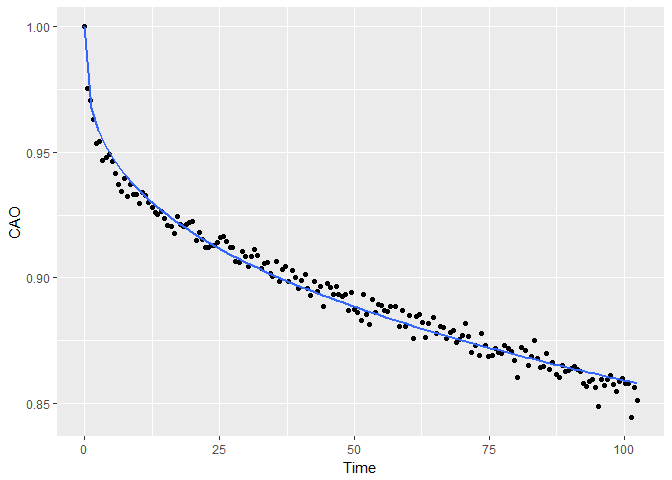

``` r
#Coefficient of correlation for CA/CAo vs Time (model=m3)#
Rsquared_CAO <- cor(CAM$CAO, predict(m3))

#generate table for regression parameters#
reg3<- tidy(m3)

e <- reg3$estimate
e <- e[c(1)]

f <- reg3$estimate
f <- f[c(2)]

#regression for CA using next method#
m4 <- nls(CAT~h*(Time^g)+1,start=list(h=1,g=1), data=CAM)
m4
```

    ## Nonlinear regression model
    ##   model: CAT ~ h * (Time^g) + 1
    ##    data: CAM
    ##       h       g 
    ## 0.02877 0.37756 
    ##  residual sum-of-squares: 0.004488
    ## 
    ## Number of iterations to convergence: 9 
    ## Achieved convergence tolerance: 4.222e-07

``` r
CATplot <- ggplot(data=CAM, aes(x=Time, y=CAT))+
  geom_point()+
  geom_smooth(method="nls",
              formula=y~1+(h*(x^g)),
              method.args=list(start=c(h=1, g=1)),
              se=FALSE)
print(CATplot)
```

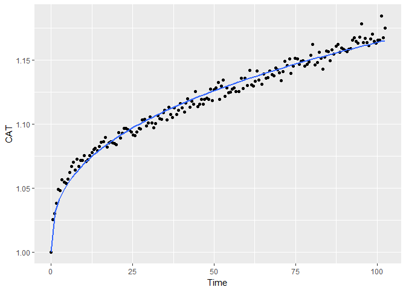

``` r
Rsquared_CAT <- cor(CAM$CAT, predict(m4))

#generate table or regression parameters#
reg4 <- tidy(m4)

h <- reg4$estimate
h <- h[c(1)]

g <- reg4$estimate
g <- g[c(2)]

#Fit CAeq using the range from Diam vs Time regression and the model m4#
CATeq <- (Co)/(1+(h*(range^g)))

#Fit CAeq using the range from Diam vs Time regression and the model m3#
CAOeq <- (1+e*range^f)*(Co)

#Store the information for this rep in a data frame#
CM_S2_2B <- data.frame(range, b, e, f, g, h, Rsquared_Diam, Rsquared_CAO, Rsquared_CAT, CAOeq, CATeq)

#Pull the data from the desktop#
cadata <- readxl::read_excel("CM-S2-2C_FINAL.xlsx")
cadata <- data.frame(cadata)

#Select on the variables of CA, Time, and Diameter#
CAM <- data.frame(CA=c(cadata$Var.6), Time=c(cadata$Var.13), Diam=c(cadata$Var.11))

#Select only the values in the column which are numeric#
CAM <- CAM[!is.na(as.numeric(as.character(CAM$CA))), ]
```

    ## Warning in `[.data.frame`(CAM, !is.na(as.numeric(as.character(CAM$CA))), :
    ## NAs introduced by coercion

``` r
#Transform the data back into numbers, extract CAo (Co)#
CA<-c(as.numeric(levels(CAM$CA))[CAM$CA])
```

    ## Warning: NAs introduced by coercion

``` r
Time<-c(as.numeric(levels(CAM$Time))[CAM$Time])
```

    ## Warning: NAs introduced by coercion

``` r
Diam<-c(as.numeric(levels(CAM$Diam))[CAM$Diam])
```

    ## Warning: NAs introduced by coercion

``` r
Co<-CA[c(1)]
Do<-Diam[c(1)]

Diam <- c(Diam/Do)
CAT <- c(Co/CA)
CAO <- c(CA/Co)

CAM <- data.frame(CA=c(CA), Time=c(Time), Diam=c(Diam), CAO=c(CAO), CAT=c(CAT))

#Plot raw data Diameter vs Time#
library(ggplot2)
Diamplot <- ggplot(CAM, aes(Time, Diam))+
  geom_point()

print(Diamplot)
```

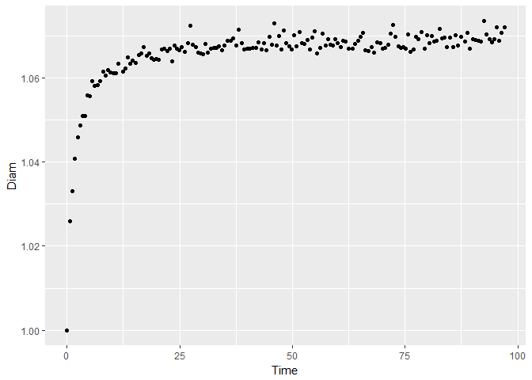

``` r
#regression for Diam vs Time#
m <- nls(Diam ~ 1+b*(1-exp(-Time/a)),start=list(a=1,b=1), data=CAM)
m
```

    ## Nonlinear regression model
    ##   model: Diam ~ 1 + b * (1 - exp(-Time/a))
    ##    data: CAM
    ##       a       b 
    ## 2.41652 0.06765 
    ##  residual sum-of-squares: 0.001092
    ## 
    ## Number of iterations to convergence: 11 
    ## Achieved convergence tolerance: 9.903e-06

``` r
#plot for Diam vs time#
Diamplot1<-ggplot(data=CAM, aes(x=Time,y=Diam))+
  geom_point()+
  geom_smooth(method="nls", 
              formula=y~1+b*(1-exp(-x/a)),
              method.args=list(start=c(a=1, b=1)),
              se=FALSE,
              data=CAM,
              color="red")

print(Diamplot1)
```

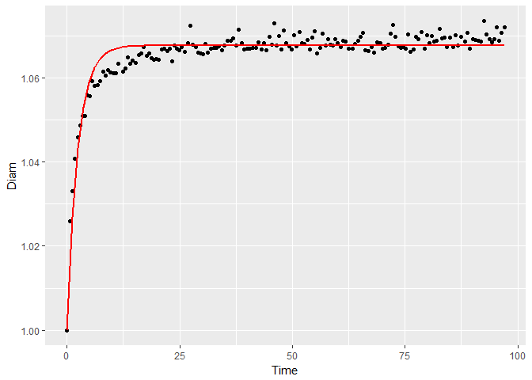

``` r
#Coefficient of Correlation for Diam vs Time model#
Rsquared_Diam <- cor(CAM$Diam, predict(m))

#generate table for regression parameters#
library(broom)
reg <- tidy(m)

#transform a parameter into range of regression#
a <- reg$estimate
a <- a[c(1)]
range <- 3*a

#make a variable for the b parameter for diameter vs time#
b <- reg$estimate
b <- b[c(2)]

#regression for CAO=(CA/Cao) vs Time#
m3 <- nls(CAO~1+e*(Time^f),start=list(e=1,f=1), data=CAM)
m3
```

    ## Nonlinear regression model
    ##   model: CAO ~ 1 + e * (Time^f)
    ##    data: CAM
    ##        e        f 
    ## -0.04603  0.31949 
    ##  residual sum-of-squares: 0.007597
    ## 
    ## Number of iterations to convergence: 9 
    ## Achieved convergence tolerance: 1.496e-06

``` r
#plot for m3#
CAOplot <- ggplot(data=CAM, aes(x=Time, y=CAO))+
  geom_point()+
  geom_smooth(method="nls",
              formula=y~1+(e*x^f),
              method.args=list(start=c(e=1, f=1)),
              se=FALSE)

print(CAOplot)
```

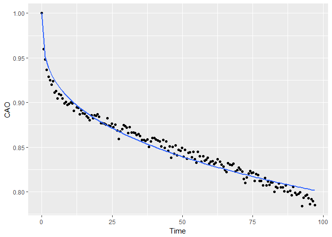

``` r
#Coefficient of correlation for CA/CAo vs Time (model=m3)#
Rsquared_CAO <- cor(CAM$CAO, predict(m3))

#generate table for regression parameters#
reg3<- tidy(m3)

e <- reg3$estimate
e <- e[c(1)]

f <- reg3$estimate
f <- f[c(2)]

#regression for CA using next method#
m4 <- nls(CAT~h*(Time^g)+1,start=list(h=1,g=1), data=CAM)
m4
```

    ## Nonlinear regression model
    ##   model: CAT ~ h * (Time^g) + 1
    ##    data: CAM
    ##       h       g 
    ## 0.04303 0.38266 
    ##  residual sum-of-squares: 0.01739
    ## 
    ## Number of iterations to convergence: 9 
    ## Achieved convergence tolerance: 2.206e-06

``` r
CATplot <- ggplot(data=CAM, aes(x=Time, y=CAT))+
  geom_point()+
  geom_smooth(method="nls",
              formula=y~1+(h*(x^g)),
              method.args=list(start=c(h=1, g=1)),
              se=FALSE)
print(CATplot)
```

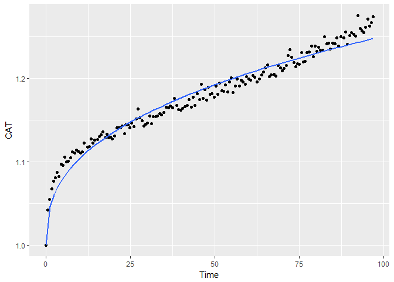

``` r
Rsquared_CAT <- cor(CAM$CAT, predict(m4))

#generate table or regression parameters#
reg4 <- tidy(m4)

h <- reg4$estimate
h <- h[c(1)]

g <- reg4$estimate
g <- g[c(2)]

#Fit CAeq using the range from Diam vs Time regression and the model m4#
CATeq <- (Co)/(1+(h*(range^g)))

#Fit CAeq using the range from Diam vs Time regression and the model m3#
CAOeq <- (1+e*range^f)*(Co)

#Store the information for this rep in a data frame#
CM_S2_2C <- data.frame(range, b, e, f, g, h, Rsquared_Diam, Rsquared_CAO, Rsquared_CAT, CAOeq, CATeq)
```

Results
-------

The results for this analysis are shown in the table below. The R-squared values for each of the regressions, as well as all of the results and parameters for the regressions are shown in the table. These results show the mean equilibrium advancing contact angle (CAOeq) for each trial. These results are only for the Carthage Marble. The mean equilibrium advancing contact angle of all 12 of these trails was found to be 75.6 degrees.

``` r
CM_Data <- rbind.data.frame(CM_S1_1A=CM_S1_1A, CM_S1_1B=CM_S1_1B, CM_S1_1C=CM_S1_1C, CM_S1_2A=CM_S1_2A, CM_S1_2B=CM_S1_2B, CM_S1_2C=CM_S1_2C, CM_S2_1A=CM_S2_1A, CM_S2_1B=CM_S2_1B, CM_S2_1C=CM_S2_1C, CM_S2_2A=CM_S2_2A, CM_S2_2B=CM_S2_2B, CM_S2_2C=CM_S2_2C)

Mean_Eq_Adv_Contact_Angle_CM <- mean(CM_Data[["CAOeq"]])

print(CM_Data, digits = NULL,
      quote = FALSE, right = TRUE, row.names = TRUE)
```

    ##              range          b           e         f         g          h
    ## CM_S1_1A  1.423649 0.09645755 -0.13686083 0.1443368 0.1901972 0.15109395
    ## CM_S1_1B  4.551046 0.08993186 -0.04516210 0.2652040 0.3024376 0.04486350
    ## CM_S1_1C  2.605410 0.04688790 -0.04917672 0.2395211 0.2746976 0.04911550
    ## CM_S1_2A  7.572744 0.10379863 -0.07104771 0.2222130 0.2668403 0.07208638
    ## CM_S1_2B 14.178063 0.11328953 -0.07090254 0.2281837 0.2669076 0.07387418
    ## CM_S1_2C 12.810958 0.12011761 -0.07548049 0.2175874 0.2575341 0.07863285
    ## CM_S2_1A 18.300808 0.06581704 -0.03096683 0.3728971 0.4349632 0.02814123
    ## CM_S2_1B 20.652897 0.08358963 -0.04490464 0.2762716 0.3120084 0.04517600
    ## CM_S2_1C 12.245642 0.06240471 -0.02952834 0.3382409 0.3787977 0.02842990
    ## CM_S2_2A  5.006723 0.10521132 -0.07888036 0.2163283 0.2621470 0.08102017
    ## CM_S2_2B  9.713551 0.04872776 -0.02992827 0.3363853 0.3775594 0.02876808
    ## CM_S2_2C  7.249562 0.06765030 -0.04603004 0.3194898 0.3826570 0.04302520
    ##          Rsquared_Diam Rsquared_CAO Rsquared_CAT    CAOeq    CATeq
    ## CM_S1_1A     0.7832933    0.9624930    0.9558977 64.92907 65.30118
    ## CM_S1_1B     0.9771222    0.9902362    0.9887020 75.00855 75.10943
    ## CM_S1_1C     0.9230583    0.9855380    0.9835392 79.87575 80.02882
    ## CM_S1_2A     0.9610856    0.9730818    0.9674154 77.53440 77.64834
    ## CM_S1_2B     0.9725896    0.9937164    0.9955598 77.40818 77.36135
    ## CM_S1_2C     0.9756510    0.9879207    0.9873329 76.86024 76.84166
    ## CM_S2_1A     0.9507864    0.9856160    0.9817973 74.42859 74.50507
    ## CM_S2_1B     0.9759257    0.9945523    0.9956226 77.06342 77.02499
    ## CM_S2_1C     0.9842352    0.9864996    0.9846251 74.54493 74.58434
    ## CM_S2_2A     0.9707733    0.9909738    0.9884958 77.47894 77.63328
    ## CM_S2_2B     0.9560681    0.9912591    0.9897313 76.86016 76.92106
    ## CM_S2_2C     0.9507709    0.9847820    0.9811847 75.28956 75.50227

``` r
Mean_Eq_Adv_Contact_Angle_CM
```

    ## [1] 75.60682

``` r
write.csv(CM_Data,"C:/Users/dell user/Desktop/GEOL_590/590_Final.csv")
```
