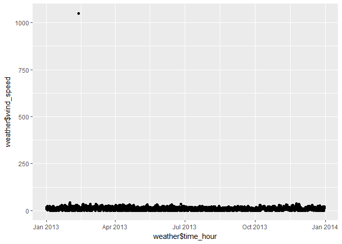
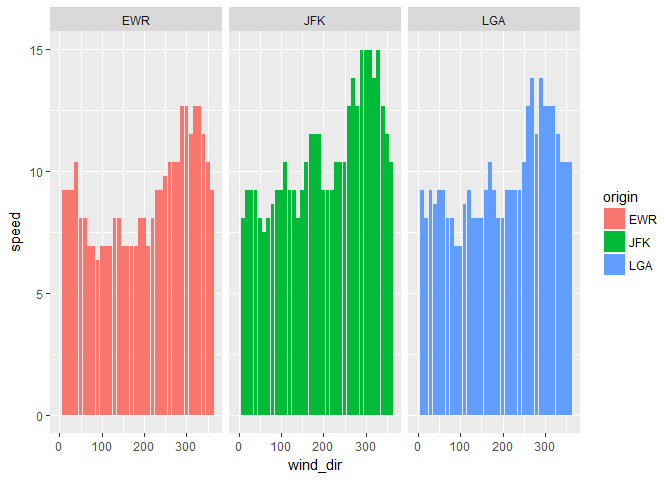
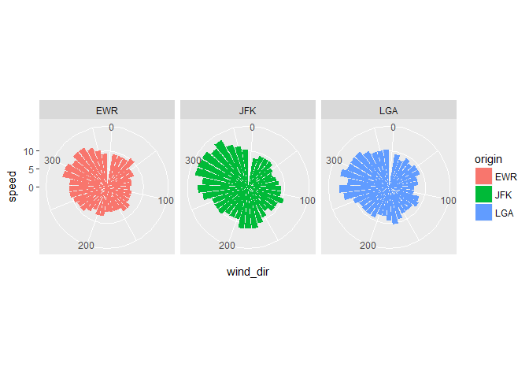
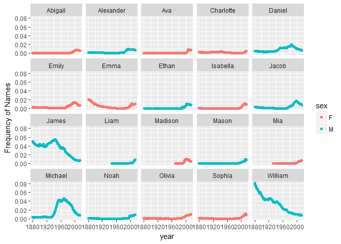

``` r
library(nycflights13)
library(tidyverse)
```

    ## Loading tidyverse: ggplot2
    ## Loading tidyverse: tibble
    ## Loading tidyverse: tidyr
    ## Loading tidyverse: readr
    ## Loading tidyverse: purrr
    ## Loading tidyverse: dplyr

    ## Conflicts with tidy packages ----------------------------------------------

    ## filter(): dplyr, stats
    ## lag():    dplyr, stats

``` r
library(babynames)
weather <- data.frame(nycflights13::weather)

library(ggplot2)
#Question 1:Determine whether there are any clear outliers in wind speed (wind_speed) that should be rejected. If so, filter those bad point(s) and proceed.

#plot the data so that we can visualize wind speed for outliers
ggplot(weather, aes(x=weather$time_hour, y=weather$wind_speed))+
  geom_point()
```

    ## Warning: Removed 3 rows containing missing values (geom_point).



``` r
#filter the data so that outliers in wind speed are removed  
filtered_wind_speed<- filter(weather, wind_speed<250)

#Question 2:What direction has the highest median speed at each airport? Make a table and a plot of median wind speed by direction, for each airport.

#sort the median wind speed for each direction for each airport
median <- filtered_wind_speed %>%
  group_by(origin, wind_dir) %>% #Split
  summarize (
    speed=median(wind_speed, na.rm=TRUE) #Apply
  )
#combine
median
```

    ## Source: local data frame [114 x 3]
    ## Groups: origin [?]
    ## 
    ##    origin wind_dir    speed
    ##     <chr>    <dbl>    <dbl>
    ## 1     EWR        0  0.00000
    ## 2     EWR       10  9.20624
    ## 3     EWR       20  9.20624
    ## 4     EWR       30  9.20624
    ## 5     EWR       40 10.35702
    ## 6     EWR       50  8.05546
    ## 7     EWR       60  8.05546
    ## 8     EWR       70  6.90468
    ## 9     EWR       80  6.90468
    ## 10    EWR       90  6.32929
    ## # ... with 104 more rows

``` r
#make a bar graph of this information
bar_graph <-ggplot(median, aes(x=wind_dir, y=speed, fill=origin))+
  facet_wrap(~origin)+geom_bar(stat="identity")

print(bar_graph)
```

    ## Warning: Removed 3 rows containing missing values (position_stack).



``` r
#now make this plot as a rose diagram
rose_plot <- bar_graph+coord_polar()
print(rose_plot)
```

    ## Warning: Removed 3 rows containing missing values (position_stack).



``` r
#Question 3:Make a table with two columns: airline name (not carrier code) and median distance flown from JFK airport. The table should be arranged in order of decreasing mean flight distance.

#look at the data
nycflights13::flights
```

    ## # A tibble: 336,776 × 19
    ##     year month   day dep_time sched_dep_time dep_delay arr_time
    ##    <int> <int> <int>    <int>          <int>     <dbl>    <int>
    ## 1   2013     1     1      517            515         2      830
    ## 2   2013     1     1      533            529         4      850
    ## 3   2013     1     1      542            540         2      923
    ## 4   2013     1     1      544            545        -1     1004
    ## 5   2013     1     1      554            600        -6      812
    ## 6   2013     1     1      554            558        -4      740
    ## 7   2013     1     1      555            600        -5      913
    ## 8   2013     1     1      557            600        -3      709
    ## 9   2013     1     1      557            600        -3      838
    ## 10  2013     1     1      558            600        -2      753
    ## # ... with 336,766 more rows, and 12 more variables: sched_arr_time <int>,
    ## #   arr_delay <dbl>, carrier <chr>, flight <int>, tailnum <chr>,
    ## #   origin <chr>, dest <chr>, air_time <dbl>, distance <dbl>, hour <dbl>,
    ## #   minute <dbl>, time_hour <dttm>

``` r
airline_flights <- nycflights13::flights %>% #data set to pipe into next step
  left_join(nycflights13::airlines, by="carrier") %>% #join the data frames using carrier
  filter(origin =="JFK") %>% #filter for planes leaving JFK
  arrange(desc(distance)) %>% #arrange in order of decreasing mean flight distance
  select(name,distance) #only keep the two columns
head(airline_flights) #preview the table
```

    ## # A tibble: 6 × 2
    ##                     name distance
    ##                    <chr>    <dbl>
    ## 1 Hawaiian Airlines Inc.     4983
    ## 2 Hawaiian Airlines Inc.     4983
    ## 3 Hawaiian Airlines Inc.     4983
    ## 4 Hawaiian Airlines Inc.     4983
    ## 5 Hawaiian Airlines Inc.     4983
    ## 6 Hawaiian Airlines Inc.     4983

``` r
#Question 4: Make a wide-format data frame that displays the number of flights that leave Newark ("EWR") airport each month, from each airline.

#Split-Apply-Combine to SPLIT the data into groups based on airlines and month and filter to only use EWR data, APPLY the mean function to the data, and COMBINE the data into a wise format table.
EWR <- nycflights13::flights%>% #define the data set to pipe into the next step
  filter(origin =="EWR") %>% #filter the planes that left EWR
  group_by(carrier, month) %>% #Split into groups based on month and carrier
  summarize(n=n()) #applies a count function to the groups
EWR #look at the table
```

    ## Source: local data frame [131 x 3]
    ## Groups: carrier [?]
    ## 
    ##    carrier month     n
    ##      <chr> <int> <int>
    ## 1       9E     1    82
    ## 2       9E     2    75
    ## 3       9E     3    91
    ## 4       9E     4    88
    ## 5       9E     5   103
    ## 6       9E     6    88
    ## 7       9E     7    94
    ## 8       9E     8    96
    ## 9       9E     9    87
    ## 10      9E    10   146
    ## # ... with 121 more rows

``` r
#convert this table to a wide format using the spread function
#specify that we want to split the count data, the "n" column

EWR_month <- spread(EWR, key=month, n)
EWR_month
```

    ## Source: local data frame [12 x 13]
    ## Groups: carrier [12]
    ## 
    ##    carrier   `1`   `2`   `3`   `4`   `5`   `6`   `7`   `8`   `9`  `10`
    ## *    <chr> <int> <int> <int> <int> <int> <int> <int> <int> <int> <int>
    ## 1       9E    82    75    91    88   103    88    94    96    87   146
    ## 2       AA   298   268   295   288   297   291   303   302   282   292
    ## 3       AS    62    56    62    60    62    60    62    62    60    62
    ## 4       B6   573   532   612   567   517   506   546   544   478   501
    ## 5       DL   279   249   319   364   377   347   340   355   423   440
    ## 6       EV  3838  3480  3996  3870  4039  3661  3747  3636  3425  3587
    ## 7       MQ   212   196   228   220   226   218   228   227   214   140
    ## 8       OO    NA    NA    NA    NA    NA     2    NA    NA    NA    NA
    ## 9       UA  3657  3433  3913  4025  3874  3931  4046  4050  3573  3875
    ## 10      US   363   328   372   361   381   390   402   385   341   365
    ## 11      VX    NA    NA    NA   170   186   180   181   182   161   170
    ## 12      WN   529   490   532   518   530   501   526   520   506   526
    ## # ... with 2 more variables: `11` <int>, `12` <int>

``` r
#Question 5:Using the babynames dataset:
#Identify the ten most common male and female names in 2014. Make a plot of their frequency (prop) since 1880. (This may require two separate piped statements).

#preview the data
head(babynames)
```

    ## # A tibble: 6 × 5
    ##    year   sex      name     n       prop
    ##   <dbl> <chr>     <chr> <int>      <dbl>
    ## 1  1880     F      Mary  7065 0.07238359
    ## 2  1880     F      Anna  2604 0.02667896
    ## 3  1880     F      Emma  2003 0.02052149
    ## 4  1880     F Elizabeth  1939 0.01986579
    ## 5  1880     F    Minnie  1746 0.01788843
    ## 6  1880     F  Margaret  1578 0.01616720

``` r
#determine top 10 baby names in 2014
top10<-babynames %>% 
  filter(year==2014) %>% #only want baby names from 2014
  group_by(sex) %>% #group by sex
  top_n(10,n) %>% #select the top 10 values in the count column labeled n
  rename(sex2 = sex) %>% #renamed sex column to make it easier to join in the next step
  select(name,sex2) 

#need to preserve only the names that appear in the top 10
top10_all <- top10 %>%
  left_join(babynames, by="name", na.rm=TRUE)
top10_all
```

    ## Source: local data frame [3,753 x 6]
    ## Groups: sex2 [?]
    ## 
    ##     name  sex2  year   sex     n         prop
    ##    <chr> <chr> <dbl> <chr> <int>        <dbl>
    ## 1   Emma     F  1880     F  2003 2.052149e-02
    ## 2   Emma     F  1880     M    10 8.445946e-05
    ## 3   Emma     F  1881     F  2034 2.057538e-02
    ## 4   Emma     F  1881     M     9 8.311477e-05
    ## 5   Emma     F  1882     F  2303 1.990527e-02
    ## 6   Emma     F  1882     M     7 5.736153e-05
    ## 7   Emma     F  1883     F  2367 1.971449e-02
    ## 8   Emma     F  1883     M     7 6.223329e-05
    ## 9   Emma     F  1884     F  2587 1.880251e-02
    ## 10  Emma     F  1884     M     9 7.332513e-05
    ## # ... with 3,743 more rows

``` r
#need to filter out the males that were given female names
#apply a condition filter so that I can remove rows where sex2 does not equal sex

top10_mf <- top10 %>%
  left_join(babynames, by="name") %>%
  filter(sex2==sex)

#plot the name data
top10_plot <- ggplot(top10_mf, aes(x=year, y=prop, colour=sex))+
  geom_point()+
  ylab("Frequency of Names")+
  facet_wrap(~name)
print(top10_plot)
```



``` r
#Question 6:Make a single table of the 26th through 29th most common girls names in the year 1896, 1942, and 2016
girl_names<-babynames %>%
  filter(sex=="F", year==1896|year==1942|year==2014) %>%
  group_by(year) %>%
  mutate(rank = dense_rank(desc(n))) %>% #add a column that assigns a rank to the count column 
  filter((rank > 25) & (rank < 30)) #only rank 26, 27, 28, and 29 are displayed
girl_names
```

    ## Source: local data frame [13 x 6]
    ## Groups: year [3]
    ## 
    ##     year   sex     name     n        prop  rank
    ##    <dbl> <chr>    <chr> <int>       <dbl> <int>
    ## 1   1896     F   Martha  2022 0.008023969    26
    ## 2   1896     F   Esther  1964 0.007793805    27
    ## 3   1896     F  Frances  1964 0.007793805    27
    ## 4   1896     F    Edith  1932 0.007666819    28
    ## 5   1896     F   Myrtle  1928 0.007650945    29
    ## 6   1942     F    Helen 10014 0.007202575    26
    ## 7   1942     F  Marilyn  9904 0.007123458    27
    ## 8   1942     F    Diane  9550 0.006868843    28
    ## 9   1942     F   Martha  9513 0.006842231    29
    ## 10  2014     F Brooklyn  6767 0.003490782    26
    ## 11  2014     F     Lily  6727 0.003470148    27
    ## 12  2014     F   Hannah  6512 0.003359240    28
    ## 13  2014     F    Layla  6428 0.003315908    29

``` r
#Question 7 Do something with a data set using dplyr
library(ggplot2)
summary(diamonds)
```

    ##      carat               cut        color        clarity     
    ##  Min.   :0.2000   Fair     : 1610   D: 6775   SI1    :13065  
    ##  1st Qu.:0.4000   Good     : 4906   E: 9797   VS2    :12258  
    ##  Median :0.7000   Very Good:12082   F: 9542   SI2    : 9194  
    ##  Mean   :0.7979   Premium  :13791   G:11292   VS1    : 8171  
    ##  3rd Qu.:1.0400   Ideal    :21551   H: 8304   VVS2   : 5066  
    ##  Max.   :5.0100                     I: 5422   VVS1   : 3655  
    ##                                     J: 2808   (Other): 2531  
    ##      depth           table           price             x         
    ##  Min.   :43.00   Min.   :43.00   Min.   :  326   Min.   : 0.000  
    ##  1st Qu.:61.00   1st Qu.:56.00   1st Qu.:  950   1st Qu.: 4.710  
    ##  Median :61.80   Median :57.00   Median : 2401   Median : 5.700  
    ##  Mean   :61.75   Mean   :57.46   Mean   : 3933   Mean   : 5.731  
    ##  3rd Qu.:62.50   3rd Qu.:59.00   3rd Qu.: 5324   3rd Qu.: 6.540  
    ##  Max.   :79.00   Max.   :95.00   Max.   :18823   Max.   :10.740  
    ##                                                                  
    ##        y                z         
    ##  Min.   : 0.000   Min.   : 0.000  
    ##  1st Qu.: 4.720   1st Qu.: 2.910  
    ##  Median : 5.710   Median : 3.530  
    ##  Mean   : 5.735   Mean   : 3.539  
    ##  3rd Qu.: 6.540   3rd Qu.: 4.040  
    ##  Max.   :58.900   Max.   :31.800  
    ## 

``` r
data <- diamonds %>%
  group_by(carat, cut) %>%
  filter(color == "E")
```
